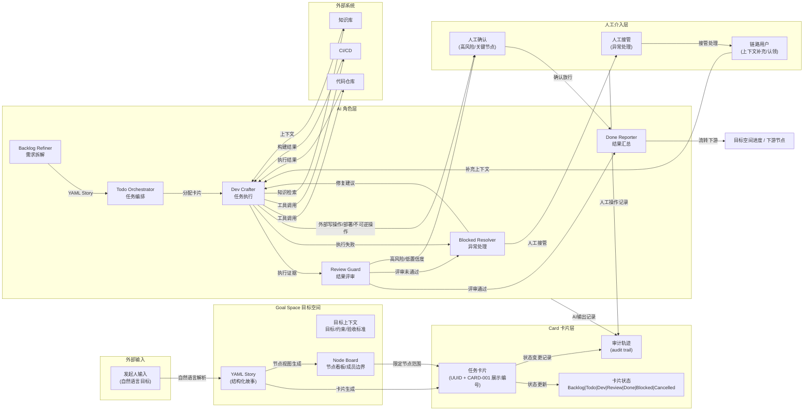
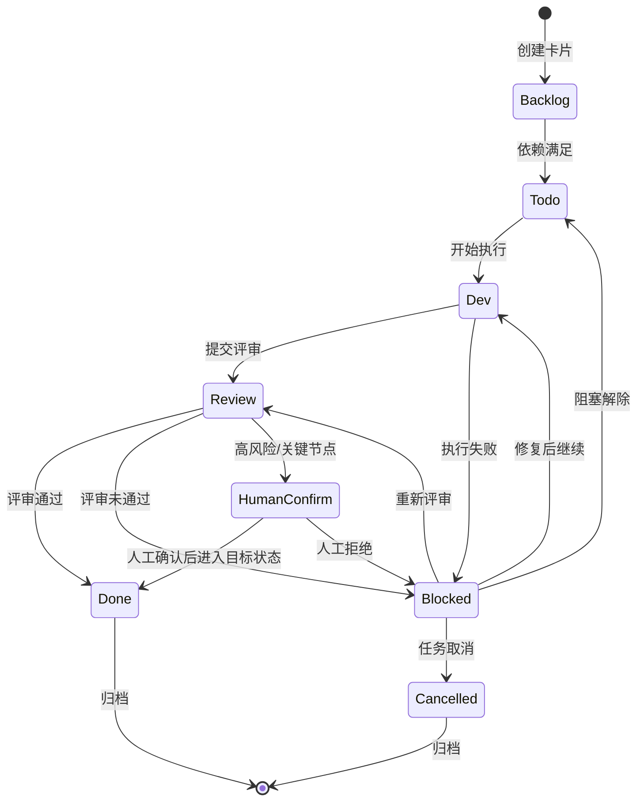
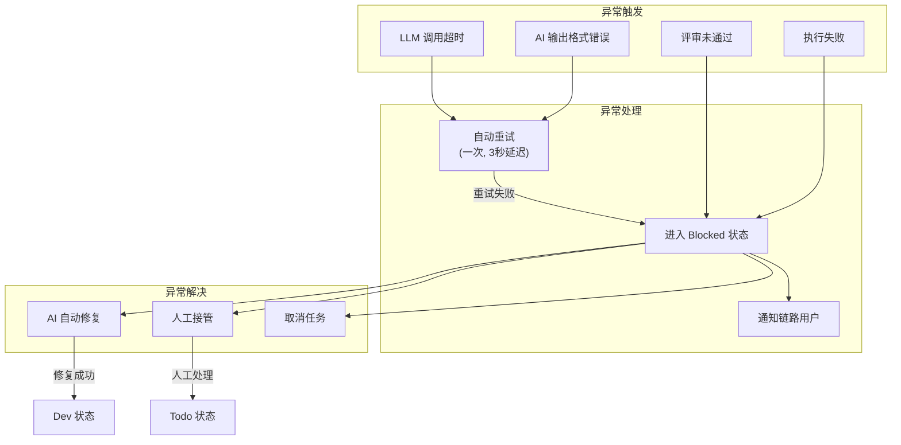
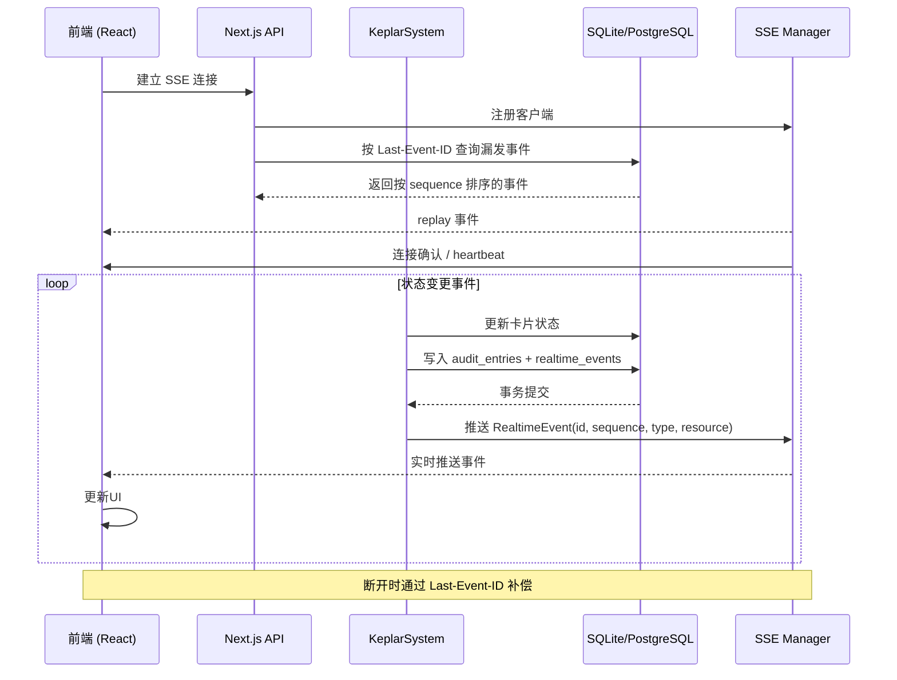

## 1. 数据流概述

数据流描述了从目标输入到最终交付的完整生命周期，包括：
- 正常流程：目标 → 节点看板 → 卡片 → AI 处理 → 人工确认门禁（如需要） → 交付
- 异常流程：执行失败/评审未通过 → 异常回流 → 修复/人工接管
- 治理流程：高风险、低置信度、外部写操作、部署和不可逆操作 → 人工确认 → 审计记录

---

## 2. 整体数据流图



---

## 3. 核心数据实体

### 3.1 Goal Space（目标空间）

| 字段 | 类型 | 说明 |
|------|------|------|
| id | UUID | 目标空间唯一标识 |
| name | string | 目标名称 |
| description | string | 目标描述 |
| constraints | string[] | 约束条件 |
| acceptance_criteria | AcceptanceCriterion[] | 验收标准 |
| status | draft \| active \| completed | 状态 |
| created_at | timestamp | 创建时间 |
| updated_at | timestamp | 更新时间 |

### 3.2 Card（卡片）

| 字段 | 类型 | 说明 |
|------|------|------|
| id | UUID | 卡片主键 |
| display_id | string | 人类可读编号（如 CARD-001） |
| goal_space_id | UUID | 所属目标空间 |
| node_board_id | UUID \| null | 所属节点看板 |
| title | string | 卡片标题 |
| description | string | 卡片描述 |
| priority | number | 优先级，数值越大越优先 |
| risk_level | low \| medium \| high \| critical | 风险等级 |
| state | backlog \| todo \| dev \| review \| done \| blocked \| cancelled | 持久化状态 |
| assignee | string \| null | 责任人 |
| lane | string | 当前泳道 |
| evidence | Evidence[] | 执行证据 |
| audit_trail | AuditEntry[] | 审计轨迹 |
| created_at | timestamp | 创建时间 |
| updated_at | timestamp | 更新时间 |

### 3.3 Audit Trail（审计轨迹）

| 字段 | 类型 | 说明 |
|------|------|------|
| card_id | string | 关联卡片 |
| timestamp | timestamp | 时间戳 |
| actor | human \| AI_role \| system | 操作者 |
| action | card_created \| state_changed \| ai_output \| human_intervention \| blocked \| resumed | 操作类型 |
| before_state | string \| null | 变更前状态 |
| after_state | string \| null | 变更后状态 |
| details | JSON | 详情 |
| evidence | JSON \| null | 证据 |

---

## 4. 卡片状态流转



---

## 5. AI 角色数据交互

### 5.1 Backlog Refiner → Todo Orchestrator

```
输入: 自然语言目标
输出: YAML Story (结构化任务描述)

YAML Story {
  goal: string
  constraints: string[]
  acceptance_criteria: {
    criterion: string
    evidence: string[]
  }[]
  tasks: {
    id: string
    display_id: string
    title: string
    priority: number
    risk_level: low|medium|high|critical
    assignee: string|null
  }[]
  dependencies: string[]
  output_requirements: string[]
  risk_hints: string[]
}
```

### 5.2 Todo Orchestrator → Dev Crafter

```
输入: 任务卡片 + 依赖关系
输出: 卡片分配计划

CardAssignment {
  card_id: string
  assigned_lane: string
  execution_order: number
  dependencies: string[]
  estimated_duration: string
  risk_flags: string[]
}
```

### 5.3 Dev Crafter → Review Guard

```
输入: 任务卡片 + 上下文
输出: 实现证据

ImplementationEvidence {
  card_id: string
  output: string
  evidence: {
    type: code|document|test|diagram
    content: string
    location: string
  }[]
  confidence: number (0-1)
  blockers: string[]
}
```

### 5.4 Review Guard → Done Reporter / Blocked Resolver

```
输入: 实现证据 + 验收标准
输出: 评审结果

ReviewResult {
  card_id: string
  passed: boolean
  criteria_check: {
    criterion: string
    met: boolean
    evidence_required: string[]
    evidence_provided: string[]
  }[]
  comments: string
  confidence: number (0-1)
  next_action: proceed|revise|human_confirm
}
```

---

## 6. 异常回流数据流



---

## 7. 实时数据同步流 (SSE)



---

## 8. 外部系统集成数据流

```mermaid
flowchart LR

subgraph AI_AGENT["AI Agent (Dev Crafter)"]
    ToolCall["工具调用"]
end

subgraph PROTOCOL["协议层"]
    MCP["MCP"]
    ACP["ACP"]
end

subgraph EXTERNAL["外部系统"]
    subgraph CODE["代码管理"]
        GitHub["GitHub API"]
        GitLab["GitLab API"]
    end
    
    subgraph CI["持续集成"]
        GHActions["GitHub Actions"]
        Jenkins["Jenkins"]
    end
    
    subgraph KB["知识库"]
        Search["向量搜索"]
        Docs["文档系统"]
    end
end

AI_AGENT -->|"tool_use"| MCP
MCP -->|"execute"| GitHub
MCP -->|"execute"| GHActions
MCP -->|"search"| Search

GitHub -->>|"结果"| MCP
GHActions -->>|"构建结果"| MCP
Search -->>|"上下文"| MCP

AI_AGENT -->|"agent_request"| ACP
ACP -->|"delegate"| GitLab
ACP -->|"delegate"| Jenkins

GitLab -->>|"状态"| ACP
Jenkins -->>|"结果"| ACP
```

---

## 9. 数据流优先级

| 阶段 | 数据流 | 实时性要求 | 持久化 |
|------|--------|-----------|--------|
| 目标输入 | 发起人 → 系统 | 同步 | 是 |
| 卡片生成 | Backlog Refiner → 卡片 | 异步 | 是 |
| 状态更新 | 任意状态变更 | **实时 (SSE)** | 是 |
| AI 处理 | Dev Crafter → 外部系统 | 异步 | 是 |
| 人工确认 | 用户 → 确认节点 | 同步 | 是 |
| 异常通知 | 系统 → 用户 | **实时 (SSE)** | 是 |
