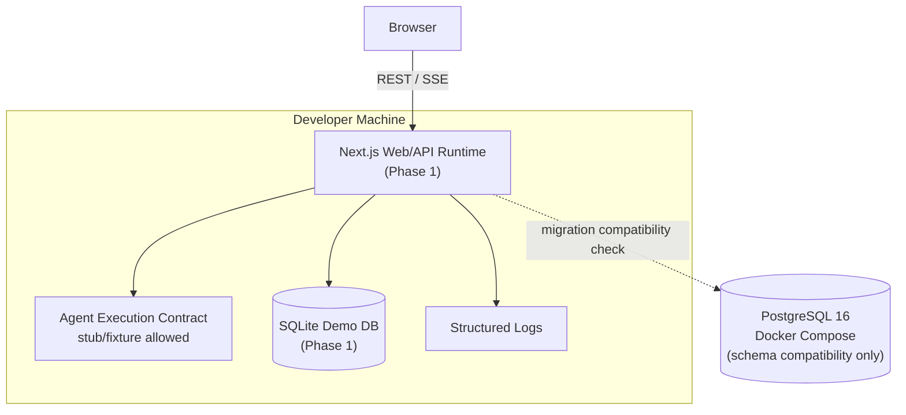
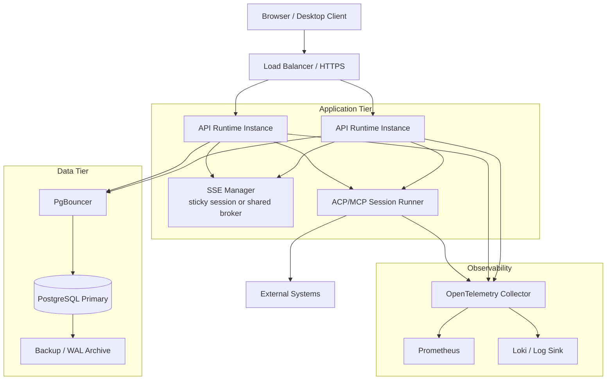

# KEPLAR Deployment Topology

本文档定义 Phase 1 本地 demo 部署门禁和后续生产目标拓扑。实际服务尚未实现。当前仓库只有 Postgres `docker-compose.yml`，没有 Web/API/worker Dockerfile。

Phase 1 只冻结 Web-first demo 部署路径：本地 Next.js Web/API runtime、SQLite demo persistence、SSE dashboard。Rust/Tauri、生产 K8s、真实 MCP/ACP/A2A 外部写集成属于后续阶段。

## 1. 第一阶段本地开发拓扑

Phase 1 不要求 Web/API/worker Dockerfile，不要求生产 compose/Kubernetes，不要求 SSE 共享事件代理，不要求真实 ACP/MCP worker 或外部写凭据隔离。

## 2. Future / Production 目标拓扑

## 3. 部署约束

### 3.1 Phase 1 本地 demo 约束

| 组件 | 约束 |
|------|------|
| Web/API Runtime | Next.js 本地运行；状态写入 SQLite；实现 REST/SSE |
| Agent Execution | 通过 `agent_executions` contract 执行；允许 stub/fixture；必须写审计和实时事件 |
| Database | SQLite demo path 必须可运行；PostgreSQL 只做 schema 兼容设计 |
| Audit | 审计写入失败时业务写入失败；审计记录不随业务软删除清除 |
| Logs | 结构化记录目标、会话、AI 执行、人工确认、审计和 SSE 投递失败 |

### 3.2 Future / Production 约束

| 组件 | 约束 |
|------|------|
| API Runtime | 无状态；状态写入数据库；SSE 需要 sticky session 或共享事件代理 |
| Worker | 外部写操作必须经过权限和人工确认门禁 |
| Database | 生产使用 PostgreSQL；SQLite 仅用于 demo/desktop 本地模式 |
| Secrets | 生产凭据必须来自 Secret/Vault，不进入镜像或仓库 |
| Observability | API、Worker、SSE、DB 访问必须产生 trace/metrics/logs |

## 4. 当前缺口

### 4.1 Phase 1 首批实现任务

- Next.js Web/API runtime 尚未实现。
- SQLite demo persistence 尚未实现。
- REST/SSE 接口入口尚未实现。

### 4.2 Future / Production 缺口

- 缺少 Web/API/worker Dockerfile。
- 缺少生产 compose 或 Kubernetes manifests。
- 缺少 SSE 共享事件代理设计。
- 缺少 ACP/MCP worker 的部署和凭据隔离设计。
