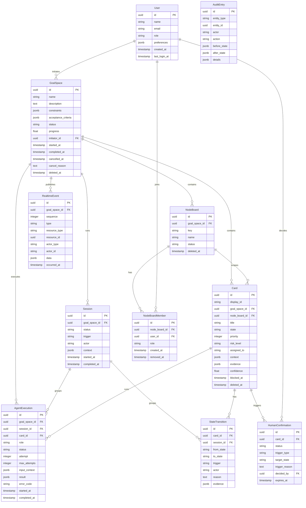

# KEPLAR ER Diagram

本文档是实体关系图的架构视图。字段级定义以 `docs/specs/database_design.md` 为准。

## 决策说明

- `GoalSpace` 是核心聚合根。
- `NodeBoard` 持久化，用于节点视图、成员访问和上下游流转。
- `NodeBoardMember` 是节点访问控制来源，不使用 JSON 成员数组做权限边界。
- `Session` 持久化，用于分组目标空间运行、SSE 恢复、审计关联和断点续传。
- `AgentExecution` 持久化，用于单次 AI 角色执行；其 `id` 是接口返回的 `task_id`。
- `RealtimeEvent` 持久化，用于 SSE replay、断线补偿和多标签页状态同步。
- `Card.id` 是 UUID，`Card.display_id` 是 `CARD-001` 形式的人类可读编号。
- 治理记录不级联删除；业务实体使用 `deleted_at` 软删除。
