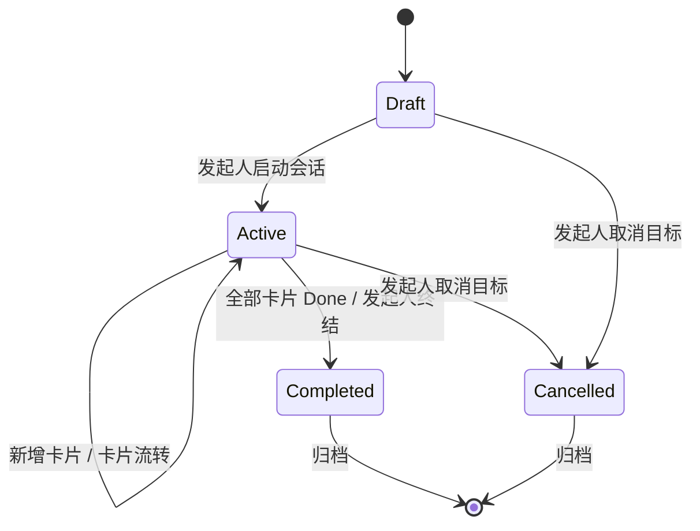
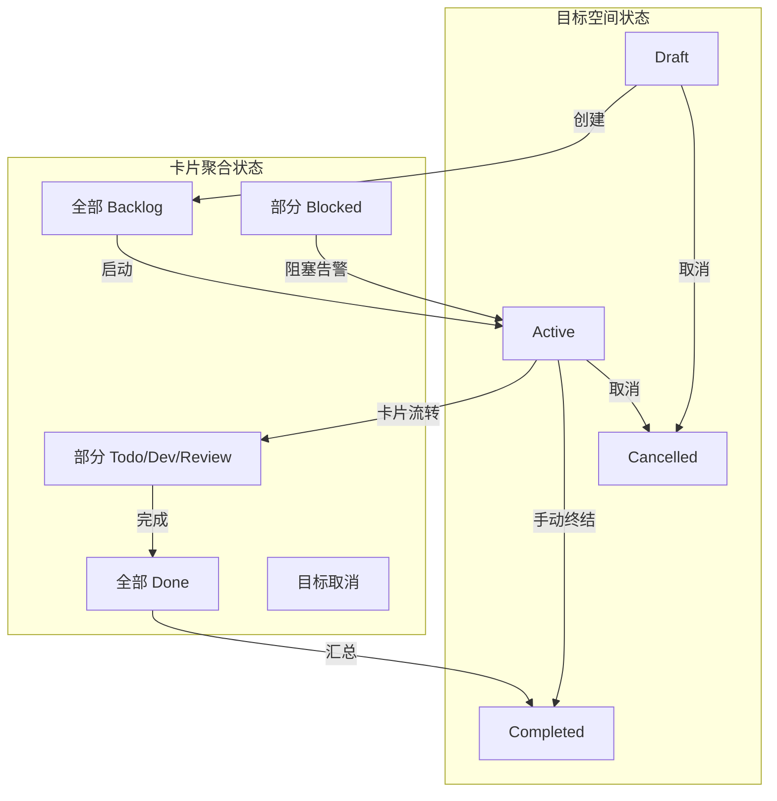

## 1. 状态定义

| 状态 | 说明 | 触发条件 |
|------|------|---------|
| **Draft** | 草稿，目标刚创建还未正式启动 | 发起人创建目标空间 |
| **Active** | 进行中，目标已开始执行 | 发起人启动会话 |
| **Completed** | 已完成，目标全部任务已结束 | 所有节点完成或发起人终结 |
| **Cancelled** | 已取消，目标被明确终止 | 发起人取消目标 |

---

## 2. 状态流转图



---

## 3. 状态详细说明

### 3.1 Draft

**含义：** 目标空间刚创建，YAML Story 已生成但还未正式启动。

**允许的操作：**
- 发起人编辑 YAML Story
- 发起人调整任务卡片
- 发起人查看预览
- 发起人确认启动

**流转到 Active 的条件：**
- 发起人点击"启动会话"
- 至少有一张任务卡片（自动生成或手动添加）
- 目标描述非空

**流转到 Cancelled 的条件：**
- 发起人主动取消目标
- 所有任务被视为无效或放弃

---

### 3.2 Active

**含义：** 目标正在执行中，AI 角色协同处理，状态实时更新。

**允许的操作：**
- AI 角色生成和分发卡片
- 链路用户认领和处理卡片
- 发起人查看 Dashboard 和进度
- 发起人对高风险任务进行人工确认
- 系统通过 SSE 推送状态变更

**流转到 Completed 的条件：**
- 所有卡片进入 Done 状态
- 发起人主动终结目标

**流转到 Cancelled 的条件：**
- 发起人主动取消目标
- 取消时必须取消运行会话、未完成 AI 执行和 pending confirmation

**流转中可能出现的异常：**
- 大量卡片进入 Blocked
- AI 角色连续失败
- 链路用户无法处理阻塞

---

### 3.3 Completed

**含义：** 目标已成功完成，进入归档状态。

**允许的操作：**
- 查看最终汇总报告
- 查看完整审计轨迹
- 发起人导出结果
- 新建目标空间（基于已有模板）

**无进一步流转**

---

### 3.4 Cancelled

**含义：** 目标已被明确取消，不再继续执行。

**允许的操作：**
- 查看取消原因
- 查看取消前审计轨迹
- 导出取消前结果

**无进一步流转**

---

## 4. 状态流转规则表

| 当前状态 | 目标状态 | 触发条件 | 执行者 |
|---------|---------|---------|-------|
| Draft | Active | 发起人启动会话 | 发起人 |
| Draft | Cancelled | 发起人取消 | 发起人 |
| Active | Active | 卡片状态变更 | AI / 系统 |
| Active | Completed | 全部卡片 Done | 系统 |
| Active | Completed | 发起人终结目标 | 发起人 |
| Active | Cancelled | 发起人取消 | 发起人 |
| Completed | (归档) | 终态 | 系统 |
| Cancelled | (归档) | 终态 | 系统 |

---

## 5. 目标空间与卡片状态联动



**联动规则：**
- 目标空间进入 Active 时，至少有一张卡片进入流转
- 任意卡片进入 Blocked 时，目标空间显示阻塞告警
- 所有卡片进入 Done 时，目标空间自动进入 Completed（或等待发起人确认）

---

## 6. Goal Space 数据结构

```typescript
interface GoalSpace {
  id: UUID
  name: string
  description: string
  constraints: string[]
  acceptance_criteria: AcceptanceCriterion[]
  status: 'draft' | 'active' | 'completed' | 'cancelled'
  progress: number // 0-100, 基于 Done 卡片比例
  created_at: ISO8601
  updated_at: ISO8601
  started_at?: ISO8601 // 进入 Active 的时间
  completed_at?: ISO8601 // 进入 Completed 的时间
  cancelled_at?: ISO8601 // 进入 Cancelled 的时间
  cancel_reason?: string

  // 聚合数据
  card_counts: {
    backlog: number
    todo: number
    dev: number
    review: number
    done: number
    blocked: number
    cancelled: number
  }

  // 创建者
  initiator_id: string
}

interface AcceptanceCriterion {
  id: string
  criterion: string
  evidence: string[]
  met: boolean
}
```

---

## 7. 状态转换事件

```typescript
interface GoalSpaceStateTransition {
  goal_space_id: string
  from_status: 'draft' | 'active' | 'completed' | 'cancelled'
  to_status: 'draft' | 'active' | 'completed' | 'cancelled'
  trigger: 'session_started' | 'all_cards_done' | 'manually_completed' | 'cancelled'
  actor: 'human' | 'system'
  timestamp: ISO8601
  details?: {
    card_id?: string // 触发事件的相关卡片
    reason?: string
  }
}
```

---

## 8. 审计轨迹

每个状态流转必须记录：

```typescript
interface GoalSpaceAuditEntry {
  goal_space_id: string
  timestamp: ISO8601
  actor: 'human' | 'system'
  action: 'created' | 'status_changed' | 'card_added' | 'manually_completed' | 'cancelled'
  before_status?: 'draft' | 'active' | 'completed' | 'cancelled'
  after_status?: 'draft' | 'active' | 'completed' | 'cancelled'
  details: {
    card_count?: number
    trigger?: string
    summary?: string
  }
}
```

---

## 9. UI 颜色标识

| 状态 | UI 颜色 | 含义 |
|------|--------|------|
| Draft | 灰色 (#6B7280) | 规划中 |
| Active | 蓝色 (#0EA5E9) | 进行中 |
| Completed | 绿色 (#10B981) | 已完成 |
