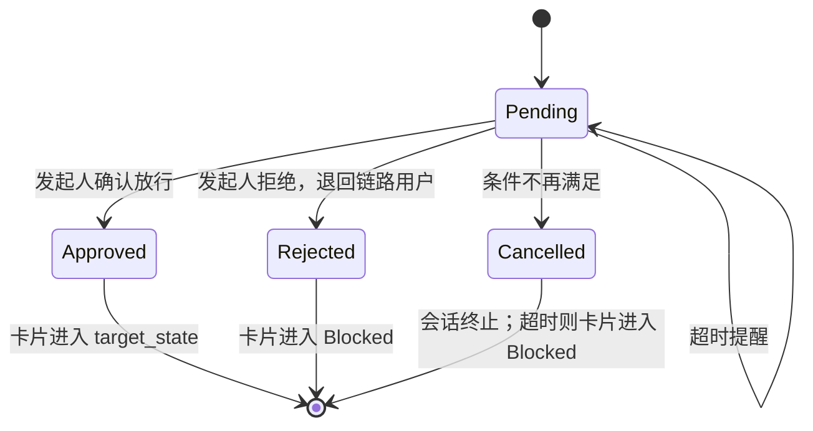
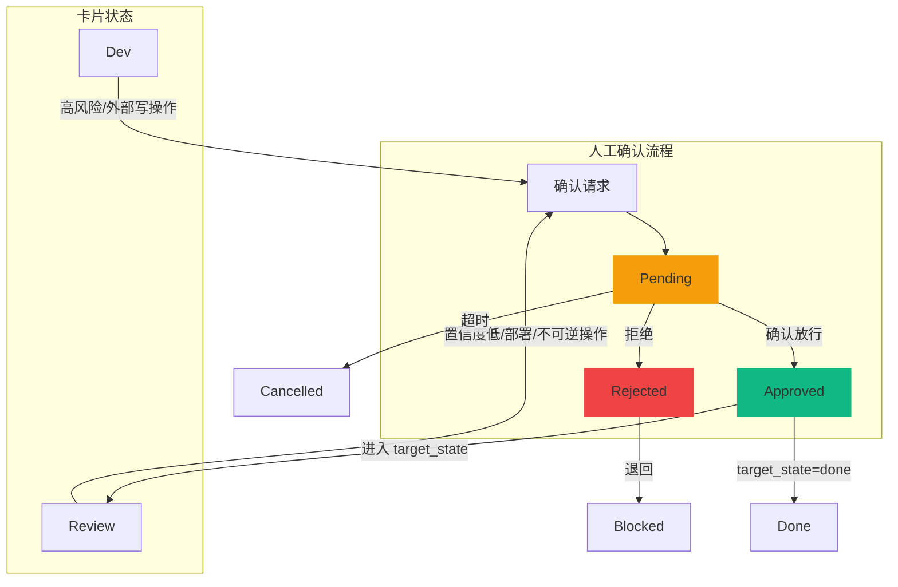

## 1. 状态定义

人工确认是针对**高风险任务**、**AI 置信度不足**、**外部写操作**、**部署**或**不可逆操作**的强制门禁流程。确认节点不是独立实体，而是附着在特定卡片上的**确认会话**。

| 状态 | 说明 | 触发条件 |
|------|------|---------|
| **Pending** | 待确认，确认请求已发出等待处理 | Review Guard 触发 / AI 置信度低 |
| **Approved** | 已放行，发起人确认任务可以进入目标状态 | 发起人点击确认 |
| **Rejected** | 已拒绝，发起人拒绝并退回 | 发起人点击拒绝 |
| **Cancelled** | 已取消，条件变化确认不再需要 | 任务状态变化 / AI 重新评分；超时取消会同时阻塞卡片 |

---

## 2. 状态流转图



---

## 3. 触发场景

### 3.1 高风险任务触发

```typescript
interface HumanConfirmTrigger {
  type: 'high_risk' | 'external_write' | 'deployment' | 'irreversible'
  card_id: string
  target_state: 'dev' | 'review' | 'done'
  risk_level: 'high' | 'critical'
  reason: string // 如：涉及外部系统、高价值操作、不可逆操作
  triggered_by: 'Review Guard' | 'Todo Orchestrator'
}
```

**高风险判断规则：**
- 卡片带有 `high-risk` tag
- 操作涉及外部系统修改（代码仓库写操作、CI/CD 部署）
- 影响范围跨越多个节点
- 执行结果不可逆

### 3.2 AI 置信度不足触发

```typescript
interface LowConfidenceTrigger {
  type: 'low_confidence'
  card_id: string
  target_state: 'review' | 'done'
  confidence: number // 0.0 - 1.0
  threshold: 0.7 // 低于此值触发人工确认
  reason: string // 如：证据不完整、边界情况
}
```

**置信度判断规则：**
- Review Guard 输出 confidence < 0.7
- Dev Crafter 输出 confidence < 0.6
- AI 输出格式异常，触发 fallback

---

## 4. 状态详细说明

### 4.1 Pending

**含义：** 确认请求已发出，等待发起人处理。

**允许的操作：**
- 发起人查看确认请求详情
- 发起人审阅风险说明
- 发起人查看 AI 分析结果
- 发起人做出决策（确认/拒绝）
- 链路用户查看被阻塞的确认请求

**超时处理：**
- 超过 30 分钟未处理：发送提醒
- 超过 2 小时未处理：升级通知
- 超过 24 小时：确认会话自动 Cancelled，卡片进入 Blocked，阻塞原因为"人工确认超时"

**门禁规则：**
- Pending 存在时，`execute`、`unblock`、`complete` 和外部写工具调用必须拒绝或暂停。
- API 应返回 `409 STATE_CONFLICT`，业务错误码为 `CONFIRMATION_REQUIRED`。
- 门禁检查必须在领域核心执行，不能只依赖 API handler 或前端。

**流转到 Approved 的条件：**
- 发起人点击"确认放行"

**流转到 Rejected 的条件：**
- 发起人点击"拒绝"

**流转到 Cancelled 的条件：**
- 卡片状态已变化（如已被处理）
- AI 重新评分达到置信度阈值
- 发起人主动取消确认

---

### 4.2 Approved

**含义：** 发起人确认放行，任务进入下一阶段。

**后续动作：**
- 卡片流转到确认记录的 `target_state`
- 审计轨迹记录确认信息
- 通知链路用户继续执行
- SSE 推送状态更新

**无进一步流转**

---

### 4.3 Rejected

**含义：** 发起人拒绝，任务退回给链路用户。

**后续动作：**
- 卡片进入 Blocked 状态
- 记录拒绝原因
- 通知链路用户处理
- 发起人可以选择"要求补充信息"

**无进一步流转**

---

### 4.4 Cancelled

**含义：** 确认会话终止，不再需要人工确认。

**原因：**
- 条件变化（卡片已被处理）
- AI 自动修复（置信度提升）
- 超时自动取消

**后续动作：**
- 条件变化导致的取消：仅终止确认会话
- 超时导致的取消：卡片进入 Blocked，并记录阻塞原因

---

## 5. 状态流转规则表

| 当前状态 | 目标状态 | 触发条件 | 执行者 |
|---------|---------|---------|-------|
| (创建) | Pending | 高风险/低置信度触发 | AI (Review Guard) |
| Pending | Approved | 发起人确认 | 发起人 |
| Pending | Rejected | 发起人拒绝 | 发起人 |
| Pending | Cancelled | 超时/条件变化 | 系统 |
| Approved | (结束) | 流转到 `target_state` | 系统 |
| Rejected | (结束) | 退回 Blocked | 系统 |
| Cancelled | (结束) | 终止会话；超时则阻塞卡片 | 系统 |

---

## 6. 数据结构

```typescript
interface HumanConfirmation {
  id: UUID
  card_id: string
  status: 'pending' | 'approved' | 'rejected' | 'cancelled'

  // 触发信息
  trigger: {
    type: 'high_risk' | 'low_confidence' | 'external_write' | 'deployment' | 'irreversible'
    reason: string
    triggered_by: string // AI 角色名
    triggered_at: ISO8601
    target_state: 'dev' | 'review' | 'done'
  }

  // AI 分析摘要
  ai_analysis: {
    summary: string
    risk_factors: string[]
    recommendations: string[]
    confidence?: number
  }

  // 决策信息
  decision?: {
    outcome: 'approved' | 'rejected'
    decided_by: string // 发起人 ID
    decided_at: ISO8601
    comment?: string
    reason?: string // Rejected 时必须提供
  }

  // 时间戳
  created_at: ISO8601
  updated_at: ISO8601
  resolved_at?: ISO8601
  expires_at: ISO8601 // 24小时后自动 Cancelled
}
```

---

## 7. 与卡片状态联动



---

## 8. SSE 推送事件

```typescript
// 确认请求创建
interface ConfirmationRequestedEvent {
  type: 'confirmation_requested'
  card_id: string
  confirm_id: string
  trigger_type: 'high_risk' | 'low_confidence' | 'external_write' | 'deployment' | 'irreversible'
  target_state: 'dev' | 'review' | 'done'
  message: string
}

// 确认状态变更
interface ConfirmationDecidedEvent {
  type: 'confirmation_decided'
  card_id: string
  confirm_id: string
  old_status: ConfirmStatus
  new_status: ConfirmStatus
  decided_by?: string
}
```

---

## 9. UI 显示

| 状态 | 显示 | 颜色 |
|------|------|------|
| Pending | "待确认" + 卡片标题 | 橙色 (#F59E0B) |
| Approved | "已确认" + 时间 | 绿色 (#10B981) |
| Rejected | "已拒绝" + 原因 | 红色 (#EF4444) |
| Cancelled | "已取消" | 灰色 (#6B7280) |

---

## 10. 审计轨迹

```typescript
interface ConfirmAuditEntry {
  confirm_id: string
  card_id: string
  timestamp: ISO8601
  actor: 'human' | 'ai_role' | 'system'
  action: 'confirmation_requested' | 'confirmation_decided' | 'confirmation_cancelled' | 'timeout_warning'
  details: {
    trigger?: string
    outcome?: string
    reason?: string
    timeout_raised?: boolean
  }
}
```
