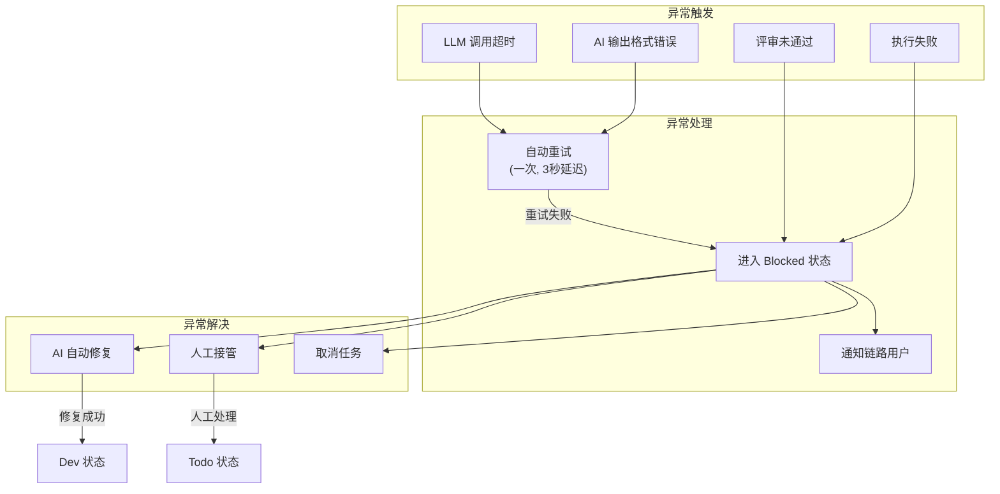

## 1. AI 协同角色用户故事

### US-009: Backlog 整理

| 属性 | 内容 |
|------|------|
| **故事编号** | US-009 |
| **角色** | AI (Backlog Refiner) |
| **故事描述** | 作为 Backlog Refiner，我接收原始目标并生成结构化的 YAML Story |
| **触发条件** | 发起人提交新的业务目标 |
| **前置条件** | 存在新的自然语言目标输入 |

**输入：** 自然语言目标描述
**输出：** YAML Story（目标、约束、验收标准、任务列表）

```
输入: "株机厂有一个10列6编组的南京地铁42号线项目开工了，交期是2027年6月，制动系统方案参考南京地铁24号线的技术方案。"

输出:
story:
  goal: "南京地铁42号线制动系统技术方案编制"
  constraints:
    - "10列6编组"
    - "2027年6月前完成"
    - "参考南京地铁24号线技术方案"
  acceptance_criteria:
    - criterion: "完成制动系统方案初稿"
      evidence: ["设计文件", "评审记录"]
    - criterion: "通过技术评审"
      evidence: ["评审意见书"]
  tasks:
    - id: CARD-001
      display_id: CARD-001
      title: "制动系统需求分析"
      priority: 90
      risk_level: medium
    - id: CARD-002
      display_id: CARD-002
      title: "参照24号线方案对比分析"
      priority: 90
      risk_level: low
  dependencies: []
  output_requirements: ["设计文件", "评审记录"]
  risk_hints: ["技术方案兼容性需验证"]
```

---

### US-010: Todo 准备

| 属性 | 内容 |
|------|------|
| **故事编号** | US-010 |
| **角色** | AI (Todo Orchestrator) |
| **故事描述** | 作为 Todo Orchestrator，我编排任务依赖关系，决定执行顺序，分配到节点 |
| **触发条件** | Backlog Refiner 生成了新的 YAML Story |
| **前置条件** | 存在待处理的任务列表 |

**输入：** YAML Story + 任务列表
**输出：** 卡片分配计划

```
输入: YAML Story with tasks[]

输出:
card_assignments:
  - card_id: CARD-001
    assigned_lane: "需求分析"
    execution_order: 1
    dependencies: []
    estimated_duration: "2h"
    risk_flags: ["依赖外部数据"]
  - card_id: CARD-002
    assigned_lane: "方案设计"
    execution_order: 2
    dependencies: ["CARD-001"]
    estimated_duration: "4h"
    risk_flags: []
```

---

### US-011: Dev 执行

| 属性 | 内容 |
|------|------|
| **故事编号** | US-011 |
| **角色** | AI (Dev Crafter) |
| **故事描述** | 作为 Dev Crafter，我执行具体任务，生成实现证据 |
| **触发条件** | Todo Orchestrator 分配了新的卡片 |
| **前置条件** | 卡片状态为 Dev |

**输入：** 任务卡片 + 上下文
**输出：** 实现证据

```
输入: CARD-001 (制动系统需求分析)

输出:
implementation_evidence:
  card_id: CARD-001
  output: "完成制动系统需求分析报告，包含：1) 技术参数确认 2) 参考24号线差异分析"
  evidence:
    - type: document
      content: "制动系统需求分析_v1.docx"
      location: "/docs/requirements/"
    - type: code
      content: "需求分析数据模型"
      location: "/models/requirements/"
  confidence: 0.92
  blockers: []
```

---

### US-012: Review 验证

| 属性 | 内容 |
|------|------|
| **故事编号** | US-012 |
| **角色** | AI (Review Guard) |
| **故事描述** | 作为 Review Guard，我验证结果是否满足验收标准 |
| **触发条件** | Dev Crafter 提交了实现证据 |
| **前置条件** | 卡片状态为 Review |

**输入：** 实现证据 + 验收标准
**输出：** 评审结果

```
输入: implementation_evidence + acceptance_criteria

输出:
review_result:
  card_id: CARD-001
  passed: true
  criteria_check:
    - criterion: "完成制动系统方案初稿"
      met: true
      evidence_required: ["设计文件"]
      evidence_provided: ["制动系统需求分析_v1.docx"]
  comments: "需求分析完整，建议进入下一阶段"
  confidence: 0.88
  next_action: proceed
```

---

### US-013: Done 总结

| 属性 | 内容 |
|------|------|
| **故事编号** | US-013 |
| **角色** | AI (Done Reporter) |
| **故事描述** | 作为 Done Reporter，我汇总节点产出，更新目标空间状态 |
| **触发条件** | Review Guard 评审通过 |
| **前置条件** | 卡片状态为 Done |

**输入：** 已完成的卡片列表
**输出：** 节点汇总报告

```
输入: [CARD-001, CARD-002, ...]

输出:
node_summary:
  node: "需求分析"
  completed_cards: 3
  total_duration: "6h"
  outputs:
    - "制动系统需求分析报告"
    - "参照方案对比分析"
  next_node: "方案设计"
  goal_progress: 25%
```

---

## 2. AI 角色数据交互规范

### 2.1 Backlog Refiner → Todo Orchestrator

```
输入: 自然语言目标
输出: YAML Story (结构化任务描述)

YAML Story Schema:
story:
  goal: string                    # 目标描述
  constraints: string[]           # 约束条件
  acceptance_criteria:             # 验收标准
    - criterion: string
      evidence: string[]           # 需要的证据类型
  tasks:                          # 任务卡片列表
    - id: string
      display_id: string
      title: string
      priority: number
      risk_level: low|medium|high|critical
      assignee: string|null
  dependencies: string[]          # 依赖关系
  output_requirements: string[]
  risk_hints: string[]
```

### 2.2 Todo Orchestrator → Dev Crafter

```
输入: 任务卡片 + 依赖关系
输出: 卡片分配计划

CardAssignment Schema:
card_assignments:
  - card_id: string
    assigned_lane: string
    execution_order: number
    dependencies: string[]
    estimated_duration: string
    risk_flags: string[]
```

### 2.3 Dev Crafter → Review Guard

```
输入: 任务卡片 + 上下文
输出: 实现证据

ImplementationEvidence Schema:
implementation_evidence:
  card_id: string
  output: string
  evidence:
    - type: code|document|test|diagram
      content: string
      location: string
  confidence: number (0-1)
  blockers: string[]
```

### 2.4 Review Guard → Done Reporter / Blocked Resolver

```
输入: 实现证据 + 验收标准
输出: 评审结果

ReviewResult Schema:
review_result:
  card_id: string
  passed: boolean
  criteria_check:
    - criterion: string
      met: boolean
      evidence_required: string[]
      evidence_provided: string[]
  comments: string
  confidence: number (0-1)
  next_action: proceed|revise|human_confirm
```

---

## 3. AI 角色异常处理规范

### 3.1 异常触发类型

| 异常类型 | 触发条件 | 处理方式 |
|---------|---------|---------|
| LLM 调用超时 | AI 角色响应超过 30 秒 | 自动重试一次，3 秒延迟 |
| AI 输出格式错误 | 返回的 JSON 不符合 Schema | 重试一次，失败后进入 Blocked |
| 评审未通过 | Review Guard 输出 passed=false | 进入 Blocked，触发 Blocked Resolver |
| 执行失败 | Dev Crafter 抛出异常 | 进入 Blocked，通知链路用户 |
| 外部系统异常 | MCP/ACP 调用失败 | 记录错误，尝试替代方案 |

### 3.2 异常回流数据流



---

## 4. AI 角色验收标准

### AC-009: Backlog Refiner

```
验收标准 1: 输入自然语言目标，输出符合 Schema 的 YAML Story
验收标准 2: 自动拆解的任务卡片数量与目标复杂度匹配（1-10张）
验收标准 3: 每个任务卡片包含 id、display_id、title、priority、risk_level 字段
验收标准 4: 无法解析时返回明确错误，不返回脏数据
```

### AC-010: Todo Orchestrator

```
验收标准 1: 根据依赖关系生成正确的执行顺序
验收标准 2: 检测循环依赖并报错
验收标准 3: 分配结果包含 assigned_lane 和 estimated_duration
```

### AC-011: Dev Crafter

```
验收标准 1: 输出包含 implementation_evidence 结构
验收标准 2: evidence 字段包含具体产出物信息
验收标准 3: confidence 分数在 0-1 之间
验收标准 4: blockers 列表准确反映阻塞原因
```

### AC-012: Review Guard

```
验收标准 1: 每个 acceptance_criteria 都有对应的 criteria_check
验收标准 2: passed=true 时才流转到下一阶段
验收标准 3: 置信度低于 0.7 时触发人工确认
```

### AC-013: Done Reporter

```
验收标准 1: 汇总报告包含 completed_cards 和 total_duration
验收标准 2: goal_progress 反映实际完成比例
验收标准 3: 正确识别下一个节点
```

---

## 5. 用户故事汇总

| 故事编号 | 角色 | 故事名称 | 优先级 |
|---------|------|---------|--------|
| US-009 | AI (Backlog Refiner) | Backlog 整理 | P0 |
| US-010 | AI (Todo Orchestrator) | Todo 准备 | P0 |
| US-011 | AI (Dev Crafter) | Dev 执行 | P0 |
| US-012 | AI (Review Guard) | Review 验证 | P0 |
| US-013 | AI (Done Reporter) | Done 总结 | P0 |
