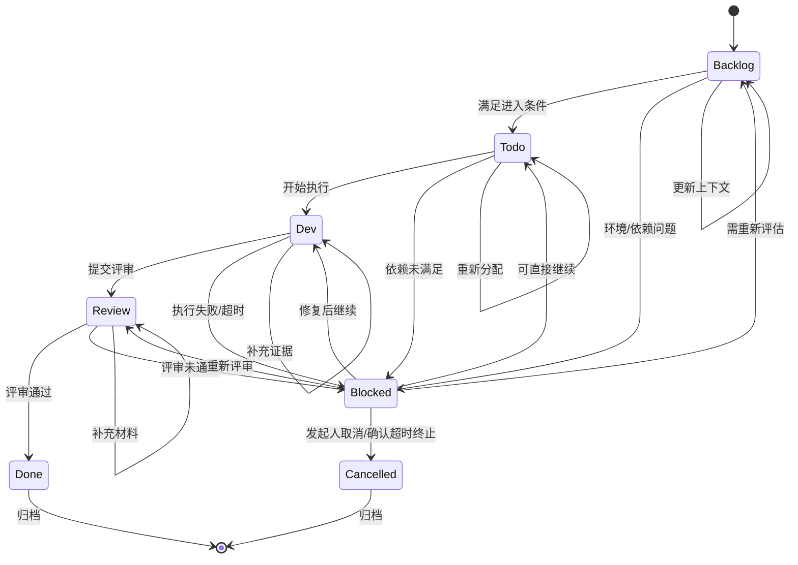
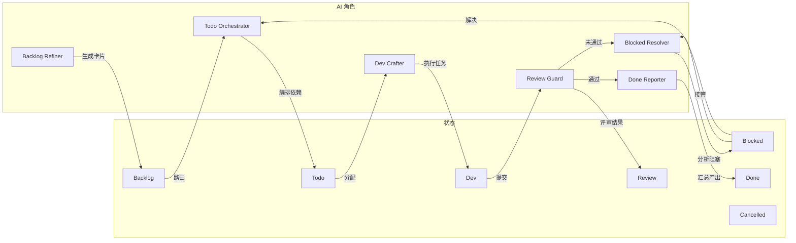

## 1. 状态定义

| 状态 | 说明 | 触发条件 |
|------|------|---------|
| **Backlog** | 待处理，任务刚创建或刚从 Blocked 恢复 | 卡片创建 / Blocked 解决后路由 |
| **Todo** | 已准备，任务明确可以开始执行 | Backlog 满足前置条件 |
| **Dev** | 开发中，任务正在被 AI 或人工执行 | Todo 开始执行 |
| **Review** | 评审中，任务产出等待验证 | Dev 提交评审 |
| **Done** | 完成，任务通过评审或已确认 | Review 通过验收标准 |
| **Blocked** | 阻塞，任务因异常暂停等待处理 | 任意阶段遇到问题 |
| **Cancelled** | 已取消，任务被明确终止 | 发起人取消 / 确认超时升级 / 业务目标终止 |

`active` 和 `waiting` 不作为卡片持久化状态；它们只能作为 UI 派生状态或展示分组。

---

## 2. 完整状态流转图



---

## 3. 状态详细说明

### 3.1 Backlog

**含义：** 任务卡片刚创建或刚从 Blocked 恢复，处于待认领状态。

**允许的操作：**
- AI 自动分析任务上下文
- 链路用户认领卡片
- 链路用户补充业务上下文
- Todo Orchestrator 编排依赖关系

**流转到 Todo 的条件：**
- 任务的依赖卡片已全部进入 Done 状态
- 链路用户已认领
- 上下文信息完整

**流转到 Blocked 的条件：**
- 外部系统依赖不可用
- 缺少必要的上下文信息
- 链路用户主动标记阻塞

---

### 3.2 Todo

**含义：** 任务已准备好，可以开始执行。

**允许的操作：**
- Todo Orchestrator 分配执行计划
- Dev Crafter 接收任务
- 链路用户查看和补充上下文
- AI 开始执行前的准备工作

**流转到 Dev 的条件：**
- Dev Crafter 开始执行
- 上下文准备完整

**流转到 Blocked 的条件：**
- 执行前置条件不满足
- 依赖的外部资源不可用
- 链路用户发现执行障碍

---

### 3.3 Dev

**含义：** 任务正在被 AI（Dev Crafter）或链路用户执行。

**允许的操作：**
- Dev Crafter 生成实现证据
- 调用外部工具（MCP/ACP）
- 链路用户补充执行上下文
- AI 处理超时重试

**流转到 Review 的条件：**
- 实现证据已生成
- confidence >= 0.7
- 无 blocker 或 blocker 已标注

**流转到 Blocked 的条件：**
- LLM 调用超时（>30s）
- 外部工具调用失败
- 执行结果不符合预期
- AI 输出格式错误

---

### 3.4 Review

**含义：** 任务产出正在等待 Review Guard 评审或人工确认。

**允许的操作：**
- Review Guard 自动评审
- 触发人工确认（高风险/置信度低）
- 链路用户查看评审结果
- 发起人进行人工确认

**流转到 Done 的条件：**
- 所有 acceptance_criteria 检查通过
- Review Guard 给出 passed=true
- 人工确认放行（如需要）

**流转到 Blocked 的条件：**
- 评审未通过（passed=false）
- 置信度低于阈值（<0.7）
- 缺少必要的证据
- 人工拒绝

---

### 3.5 Done

**含义：** 任务完成，进入终态归档。

**允许的操作：**
- Done Reporter 汇总节点产出
- 更新目标空间进度
- 审计轨迹记录完成
- 查看最终产出物

**无进一步流转**

---

### 3.6 Blocked

**含义：** 任务因异常暂停，需要处理。

**允许的操作：**
- Blocked Resolver 分析阻塞原因
- 链路用户查看阻塞详情
- 链路用户选择处理方式（自行修复/申请接管/取消）
- AI 自动尝试修复
- 发起人介入处理

**流转到 Backlog 的条件：**
- 阻塞原因需重新评估
- 上下文信息不足需重新收集

**流转到 Todo 的条件：**
- 阻塞已解决，可以继续执行

**流转到 Dev 的条件：**
- 修复完成，直接继续执行

**流转到 Review 的条件：**
- 修复后需重新评审

**流转到终态（取消）：**
- 任务被取消，不再执行

---

### 3.7 Cancelled

**含义：** 任务被明确终止，不再进入执行或评审流程。

**允许的操作：**
- 查看取消原因
- 查看取消前审计轨迹
- Done Reporter 在目标汇总中记录取消项

**无进一步流转**

---

## 4. 状态流转规则表

| 当前状态 | 目标状态 | 触发条件 | 执行者 |
|---------|---------|---------|-------|
| Backlog | Todo | 依赖满足，上下文完整 | AI (Todo Orchestrator) |
| Backlog | Blocked | 环境/依赖不可用 | AI (Backlog Refiner) |
| Todo | Dev | 开始执行 | AI (Dev Crafter) |
| Todo | Blocked | 前置条件不满足 | AI / 链路用户 |
| Dev | Review | 提交评审 | AI (Dev Crafter) |
| Dev | Blocked | 执行失败/超时 | AI (Dev Crafter) |
| Review | Done | 评审通过 | AI (Review Guard) / 发起人 |
| Review | Blocked | 评审未通过 | AI (Review Guard) |
| Blocked | Backlog | 解决后退回重新评估 | Blocked Resolver |
| Blocked | Todo | 阻塞解除可继续 | Blocked Resolver |
| Blocked | Dev | 修复后继续执行 | Blocked Resolver |
| Blocked | Review | 修复后重新评审 | Blocked Resolver |
| Blocked | Cancelled | 任务终止 | 发起人 / 系统 |
| Done | (归档) | 终态 | 系统 |
| Cancelled | (归档) | 终态 | 系统 |

---

## 5. AI 角色与状态流转



---

## 6. 状态转换事件数据结构

```typescript
interface StateTransition {
  card_id: string
  from_state: CardState
  to_state: CardState
  trigger: TransitionTrigger
  actor: 'human' | 'ai_role' | 'system'
  actor_name?: string
  timestamp: ISO8601
  reason?: string
  evidence?: Evidence[]
}

type CardState = 'backlog' | 'todo' | 'dev' | 'review' | 'done' | 'blocked'
  | 'cancelled'

type TransitionTrigger =
  | 'dependencies_ready'
  | 'context_complete'
  | 'execution_start'
  | 'evidence_submitted'
  | 'review_passed'
  | 'review_failed'
  | 'human_confirm'
  | 'human_reject'
  | 'human_confirm_timeout'
  | 'blocked_resolved'
  | 'task_cancelled'
```

---

## 7. 状态校验边界

状态流转必须由领域核心统一校验，API handler 只能调用领域命令，数据库约束负责防止非法枚举值和缺失字段。

| 层级 | 职责 |
|------|------|
| 领域核心 | 校验状态机、人工确认门禁、依赖满足、证据完整性 |
| API handler | 校验认证、授权、请求格式，并调用领域命令 |
| 数据库 | 约束枚举值、外键、唯一约束和事务一致性 |

任何状态变更必须与 `state_transitions` 和 `audit_entries` 在同一事务中写入；审计写入失败时，状态变更必须失败。

---

## 8. 审计轨迹记录

每个状态流转必须记录审计轨迹：

```typescript
interface AuditEntry {
  card_id: string
  timestamp: ISO8601
  actor: 'human' | AI_ROLE | 'system'
  action: 'state_changed' | 'blocked' | 'resumed' | 'human_intervention'
  before_state: CardState | null
  after_state: CardState
  details: {
    trigger?: string
    reason?: string
    blocked_root_cause?: string
    resolution?: string
  }
  evidence?: Evidence[]
}
```

---

## 9. 状态颜色标识

| 状态 | UI 颜色 | 含义 |
|------|--------|------|
| Backlog | 灰色 (#64748B) | 待处理 |
| Todo | 蓝色 (#0EA5E9) | 已准备 |
| Dev | 紫色 (#6366F1) | 执行中 |
| Review | 橙色 (#F59E0B) | 待评审 |
| Done | 绿色 (#10B981) | 已完成 |
| Blocked | 红色 (#EF4444) | 阻塞中 |
| Cancelled | 灰色 (#6B7280) | 已取消 |
