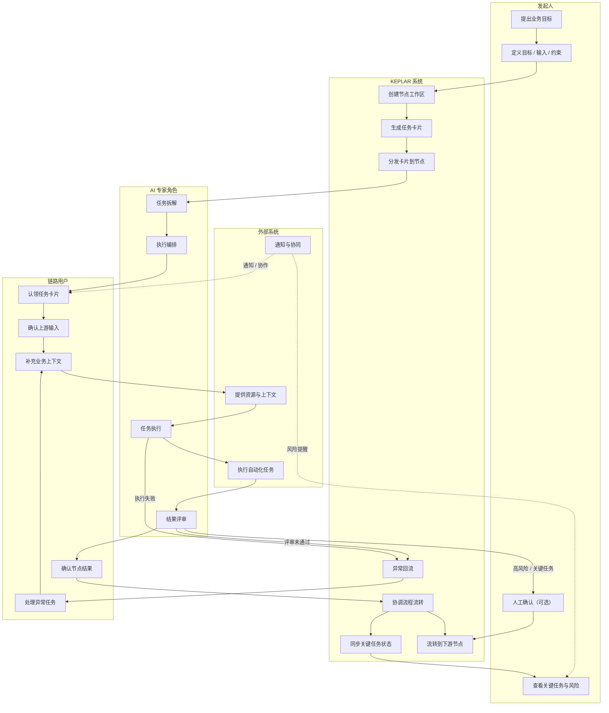

## swimlane diagram

---

## 流程说明

### 用户角色

#### 发起人（Initiator）

项目经理（对应 `OE Project`）或产品经理（对应 `IP Project`）负责发起目标，通过发起节点 `UI` 创建目标空间（`Goal Space`），定义项目目标、输入信息、约束条件与完成标准，并持续跟踪整体进度、关键风险与重要节点状态。

**发起人主要关注：**

- 目标推进情况
- 关键任务状态
- 风险与阻塞
- 人工确认节点
- 最终交付结果

---

#### 链路用户（Chain Users）

链路用户负责处理来自上游节点的任务卡片，通过链路节点 `UI` 认领任务、补充业务上下文、确认节点目标并推进执行。

**链路用户主要关注：**

- 当前节点待处理卡片
- 上下游依赖关系
- 节点输入与输出
- 异常与回流处理
- 节点结果确认

---

#### AI 专家角色（Lanes）

系统包含多个 AI 专家角色，例如：

- `Backlog Refiner`
- `Todo Orchestrator`
- `Dev Crafter`
- `Review Guard`

不同角色按照预设提示合同在各自泳道中处理卡片，逐步完成：

- 需求拆解
- 任务编排
- 执行实现
- 结果评审
- 质量控制

AI 专家角色默认自主推进任务，仅在异常或高风险场景下触发人工介入。

---

#### 外部系统（External Systems）

外部系统作为 KEPLAR 的环境层能力，为任务执行提供资源、执行、上下文、协同与治理支持。

---

### 系统入口

#### 发起节点 `UI`

用于创建目标空间、录入目标与输入信息，并监控整体目标进度、风险与关键任务状态。

发起人看到的是面向目标与治理的管理视图，而非底层 AI 执行细节。

---

#### 链路节点 `UI`

用于认领、处理和跟踪来自上游节点的任务卡片。

链路用户看到的是当前节点相关的执行视图，包括：

- 待处理卡片
- 上下文信息
- 当前执行状态
- 阻塞与异常信息
- 节点输出结果

---

#### AI 协同运行视图（内部）

用于 AI 专家角色执行自动化任务，包括：

- `Prompt Contract`
- 工具调用
- 上下文管理
- 执行轨迹
- `Structured Output`

该视图主要用于系统运行与治理，默认不直接暴露给普通业务用户。

---

### 核心执行流程

#### 1. 目标发起

发起人在发起节点 `UI` 中创建目标空间，并定义：

- 目标
- 输入信息
- 约束条件
- 完成标准
- 优先级
- 风险说明

目标空间是整个链路共享的目标上下文，而不是所有角色共享同一个操作界面。

---

#### 2. 卡片生成与分发

KEPLAR 作为节点协调系统，根据目标与上下文自动生成任务卡片，并按规则分发至当前节点或下游节点。

卡片是系统中的核心执行单元，用于承载：

- 需求与上下文
- 执行状态
- 结构化产出
- 评审与治理记录
- 节点流转关系

系统会根据目标推进情况动态协调卡片流转，而非依赖复杂状态机驱动。

---

#### 3. 节点执行

链路用户在链路节点 `UI` 中认领卡片，确认上游输入并补充业务上下文。

系统默认以 AI 自主推进为主，仅在以下场景引入人工介入：

- 信息不足
- 高风险操作
- 关键节点确认
- AI 无法继续推进
- 异常或阻塞任务

---

#### 4. AI 泳道协同

卡片在不同 AI 泳道之间流转，由 AI 专家角色逐步完成：

- 需求拆解
- 执行规划
- 任务实现
- 结果验证
- 质量评审

系统会持续生成结构化产出，例如：

- `YAML` 故事
- 执行简报
- 实现证据
- 评审结果
- 过程状态记录

---

#### 5. 结果确认与下游流转

当当前节点完成后：

- 普通任务会自动流转至下游节点
- 高风险或关键任务会进入人工确认流程
- 已完成结果会同步到目标空间视图

系统会持续更新目标推进状态，并将关键结果沉淀为后续可复用资产。

---

### 治理机制（Governance Layer）

KEPLAR 采用"明确状态 + 强治理"的运行模式。

系统维护统一的卡片持久化状态：

- `Backlog`
- `Todo`
- `Dev`
- `Blocked`
- `Review`
- `Done`
- `Cancelled`

AI 通过上下文推理提出下一步动作，但所有状态变更都必须经过领域状态机、权限矩阵、人工确认门禁和审计规则校验。

---

#### 人工确认机制

对于关键节点、高风险任务或敏感操作，系统可要求人工确认后继续执行。

---

#### 异常回流机制

当 AI 无法继续推进任务时，系统会触发异常回流，由链路用户进行：

- 人工接管
- 问题修正
- 路径调整
- 重新规划

---

#### 风险升级机制

长时间阻塞或高风险任务会自动升级至人工处理节点。

---

#### 审计与追踪

系统会保留：

- 关键决策
- 执行记录
- 阻塞原因
- 回流过程
- 节点流转历史

用于后续治理、追踪与复盘。

---

### 外部系统（Environment Layer）

#### 资源系统（Resource Systems）

提供代码、文档、数据、知识内容与历史记录等上下文资源。

---

#### 执行系统（Execution Systems）

负责自动化任务执行、验证、构建、部署与外部操作。

---

#### 上下文系统（Context Systems）

负责维护 AI 多步骤协同过程中的上下文状态、工具调用与会话连续性。

---

#### 协同系统（Collaboration Systems）

支持通知、审批、人工协作与跨节点沟通。

---

#### 治理系统（Governance Systems）

负责权限控制、风险治理、审计追踪与质量约束。

---

#### 集成系统（Integration Systems）

用于连接企业内部或外部平台，实现跨系统能力编排。

---

### 总体说明

KEPLAR 采用 **"统一目标空间 + 角色化工作视图"** 的协同模式。

所有节点围绕同一目标上下文持续推进任务，但不同角色基于职责与权限获得不同的工作视图与操作能力。

系统以目标驱动为核心，通过：

- 卡片化执行
- 多智能体协同
- 轻量治理机制
- 外部系统环境集成

实现复杂任务在多节点、多角色与多系统环境中的持续推进与可控交付。
