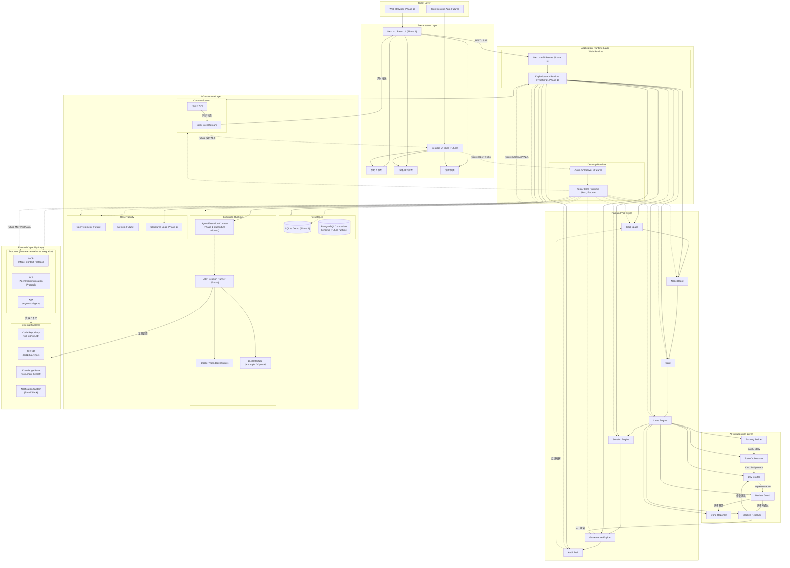

# KEPLAR 系统架构

## 1. 整体架构

KEPLAR 采用 **"统一领域模型 + 双运行时"** 的架构方式。系统在 Web 与桌面两种交付形态下提供一致的业务能力，二者共享同一套领域语义、接口契约和核心业务规则，只是在运行时、部署方式和部分基础设施实现上有所差异。

第一阶段以 **TypeScript/Drizzle schema** 作为领域类型、接口类型和数据库 schema 的主来源；Rust 运行时暂作为后续桌面/本地能力的对齐实现，不能独立发明业务语义。所有运行时必须通过同一套 API contract、状态机规则、权限矩阵和审计规则进行校验。

Phase 1 冻结为 **Web-first Board demo slice**。Next.js / React / TypeScript / Drizzle / SQLite / SSE 是首轮必交付路径；Tauri、Rust Axum、真实 MCP/ACP/A2A 外部写集成和生产级部署拓扑保留为后续阶段，详见 [`docs/README.md` § Phase 1](../README.md#phase-1)。

系统整体可分为五层：

1. **交互层** — 承载用户与系统的直接交互
2. **应用运行时层** — 承接前端请求、会话驱动和任务编排
3. **领域核心层** — KEPLAR 的业务中枢
4. **基础设施层** — 为领域核心提供持久化、执行和可观测能力
5. **外部能力层** — 连接 KEPLAR 之外的系统和服务

---

## 2. 交互层

交互层负责承载用户与系统的直接交互。Phase 1 只冻结 Web 形态，桌面形态保留为后续对齐目标。

- **Phase 1：`Next.js` / `React` Web 前端**：面向浏览器使用，负责目标空间、节点看板、卡片、会话与追踪视图等交互。
- **Future：`Tauri` 桌面前端**：面向桌面使用，提供与 Web 一致的业务能力，同时更适合本地执行、离线操作和增强型工作流场景。

**这一层的职责**是呈现不同角色视图，包括发起人视图、链路用户视图和治理视图，并通过 `REST` 和 `SSE` 与后端进行交互。

---

## 3. 应用运行时层

应用运行时层负责承接前端请求、会话驱动和任务编排。Phase 1 只实现 Web 运行时，桌面运行时不得独立扩展业务语义。

- **当前 Web 运行时**：基于 `Next.js` API Route Handlers 承载后端服务，调用 TypeScript 的 service、authorization、state-machine、audit 和 repository 层；这是当前唯一可运行的产品路径。
- **Future：桌面运行时**：基于 `Tauri` 作为前端容器，配合 `Rust` `Axum Server` 提供本地 API 和执行能力。该运行时不是 Phase 1 必交付项，后续必须对齐 Web-first contract。

后续双运行时必须实现相同的领域接口和业务语义，遵循统一的 `api-contract` 约定，对外表现为同一套 KEPLAR 能力。

> 审查说明（2026-07-11）：`crates/` 与 `apps/desktop/` 目前不是 Web 运行时的等价实现。
> “双运行时”是架构约束和未来目标，不是当前交付事实。

**这一层负责：**

- 接收用户请求
- 创建和管理目标空间
- 驱动节点看板与卡片流转
- 协调 AI 协同角色
- 处理会话状态与事件推送

---

## 4. 领域核心层

领域核心层是 KEPLAR 的业务中枢，承载系统最稳定、最核心的对象模型和规则。

**核心概念包括：**

- `Goal Space` — 统一目标空间
- `Node Board` — 节点看板
- `Card` — 任务卡片
- `Lane` — AI 泳道
- `Session` — 会话执行上下文
- `Review` — 评审结果
- `Blocked` — 阻塞与异常
- `Audit Trail` — 审计链路

**这一层**定义系统的业务边界、状态演进规则、卡片流转逻辑和治理规则。Web 运行时与桌面运行时都依赖这套核心领域定义，确保系统在不同端上的行为一致。

**持久化边界：**

- `Goal Space` 是核心聚合根。
- `Node Board` 需要持久化，用于节点视图、成员访问和上下游流转。
- `Node Board Member` 需要持久化，用于节点级访问控制。
- `Session` 需要持久化，用于分组目标空间运行、SSE 恢复、审计关联和断点续传。
- `Agent Execution` 需要持久化，用于单次 AI 角色执行；其 ID 即接口返回的 `task_id`。
- `Audit Trail` 是 append-only 治理记录，不随业务实体软删除而删除。

---

## 5. 基础设施层

基础设施层负责为领域核心提供持久化、执行和可观测能力。

**Phase 1 必交付：**

- **数据存储**：`SQLite` demo path 必须可运行，Schema 由 `Drizzle ORM` 管理；`PostgreSQL` 保持 schema 兼容设计，但不是首轮演示路径。
- **执行边界**：通过稳定 `agent_executions` contract 管理 AI 执行，可使用 stub/fixture 驱动 demo；真实 ACP runner 后续接入。
- **通信与推送**：支持 `REST` 和 `SSE`，保证交互和状态同步。
- **基础日志**：记录目标、会话、AI 执行、人工确认、审计和实时事件的关键状态。

**Future 能力：**

- `PostgreSQL` 生产运行切换和迁移验证门禁。
- 真实 `ACP` 会话执行、`MCP`/`A2A` 外部写集成。
- 桌面端 `Docker` 沙箱、文件系统操作和本地任务执行能力。
- `OpenTelemetry` 调用链路、指标和性能观测。

**这一层**负责把领域逻辑落到真实可运行的基础设施上。

---

## 6. 外部能力层

外部能力层负责连接 KEPLAR 之外的系统和服务，形成完整的任务执行环境。

**Phase 1 必交付：**

- **`SSE`**：用于实时状态推送和事件流。
- **LLM / AI execution boundary**：通过稳定输入、输出、错误和 retry contract 隔离真实执行实现。

**Future 能力：**

- **`MCP`**：用于连接模型上下文和工具能力。
- **`ACP`**：用于代理客户端执行与任务运行。
- **`A2A`**：用于 Agent 间协作通信。
- **第三方系统**：如代码仓库、`CI/CD`、知识库、文档系统、通知系统等。

**这一层**的长期作用是让 KEPLAR 不只停留在看板和任务管理，而是能够真正调用外部资源、执行任务并回写结果。Phase 1 只冻结实时推送和 AI execution boundary。

---

## 7. 宏观数据流

KEPLAR 的主数据流可以概括为：

1. Phase 1 用户通过 Web 前端发起目标、创建工作区或认领卡片；桌面前端属于后续阶段。
2. 前端请求进入 Web 运行时后端。
3. 后端调用领域核心完成目标建模、卡片生成、节点分发与状态管理。
4. 任务进入 AI 协同流程，由 `agent_executions` contract 管理单次执行；Phase 1 可使用 stub/fixture，真实 `ACP` 后续接入。
5. 后续阶段代理可调用外部系统完成检索、处理、验证和交付；Phase 1 不依赖真实外部写集成。
6. 运行时将执行结果、日志、评审结论和异常状态写回数据库。
7. 通过 `REST` 或 `SSE` 将状态变化同步回前端视图。
8. 审计、追踪和观测信息同步进入治理和可观测模块。

---

## 8. 系统架构图

---

## 9. 架构说明

KEPLAR 采用 **"统一领域模型 + 双运行时"** 的整体架构，在 Web 与桌面两种运行形态下提供一致的目标空间、节点看板、卡片流转与 AI 协同能力。系统通过共享领域语义与接口契约，保证不同运行环境下的业务行为一致性。

**系统整体由五层构成：**

### 交互层

负责承载用户操作与业务视图。Phase 1 只冻结基于 `Next.js`/`React` 的 Web 前端；基于 `Tauri` 的桌面前端属于后续阶段。系统根据不同角色提供差异化工作视图，例如发起人视图、链路节点视图和治理视图。Web 前端通过 `REST` 与 `SSE` 与后端保持实时交互。

### 应用运行时层

负责接收请求、驱动会话和协调任务流转。Phase 1 Web 运行时基于 `Next.js` API Route 与 `TypeScript` 实现的 `KeplarSystem`；桌面运行时基于 `Rust` `Axum Server`，并结合 `Tauri` 提供本地 API 与执行能力，但不属于首轮必交付。后续双运行时必须遵循统一的 `api-contract` 契约，实现一致的领域服务接口。

### 领域核心层

是系统的业务中枢，定义了 `Goal Space`、`Node Board`、`Card`、`Lane`、`Session`、`Review`、`Blocked` 和 `Audit Trail` 等核心对象模型，并负责卡片流转、AI 协同、状态推进与治理规则等核心逻辑。该层作为 Web 与桌面运行时共享的统一领域语义基础。

### 基础设施层

负责为领域核心提供持久化、执行、通信与可观测能力。Phase 1 必须完成 `SQLite` demo path、`Drizzle` schema、`agent_executions` 执行边界、`REST`/`SSE` 通信和结构化应用日志。`PostgreSQL` 生产运行切换、真实 `ACP` 会话执行、`Docker` 沙箱、本地文件系统操作以及 `OpenTelemetry` 可观测能力属于后续阶段。

### 外部能力层

负责连接 KEPLAR 与外部 AI 和企业系统，包括：

- **Phase 1 `REST` 与 `SSE`** — 用于系统交互与事件推送
- **Future `MCP`** — 用于模型上下文与工具能力集成
- **Future `ACP`** — 用于 AI Agent 会话执行
- **Future `A2A`** — 用于 Agent 间协同通信
- **第三方系统** — 如代码仓库、`CI/CD`、知识库、审批系统与通知系统等

**整体架构的数据流如下：**

1. Phase 1 用户通过 Web 界面发起目标、创建目标空间或认领卡片；桌面界面后续接入
2. 请求进入 Web 运行时后端
3. 运行时调用领域核心完成目标建模、卡片生成、任务流转与状态管理
4. AI 协同角色通过 `agent_executions` contract 驱动自动化执行；真实 `ACP` 后续接入
5. 后续执行过程中可调用 `MCP`、`A2A` 与外部系统完成检索、执行与验证
6. 执行结果、评审结论、日志与异常状态写入数据库与审计链路
7. 系统通过 `REST` 或 `SSE` 将最新状态实时同步回用户界面

KEPLAR 通过 **"目标空间 + 卡片化执行 + AI 协同 + 轻量治理"** 的架构方式，实现复杂任务在多节点、多角色与多系统环境中的持续推进与可控交付。
