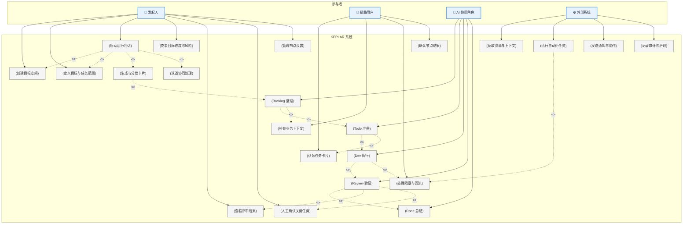

## 1. 用例图

---

## 用例图说明

本系统采用 **"统一目标空间（Unified Goal Space）"** 模型，围绕同一目标上下文组织多角色协同执行。不同角色基于职责与权限获得不同的工作视图与操作能力，而非共享同一操作界面。

发起人负责创建目标空间、定义目标与任务范围，并持续跟踪整体进度、风险状态与评审结果。在关键节点或高风险任务场景下，发起人可进行人工确认与决策介入。

链路用户负责处理节点级任务，包括认领任务卡片、补充业务上下文、处理阻塞与异常回流，以及确认当前节点的执行结果。链路用户主要关注本节点相关的输入、执行状态与上下游依赖关系。

系统内部由多个 AI 协同角色驱动自动化执行流程，包括：

- `Backlog` 整理
- `Todo` 准备
- `Dev` 执行
- `Review` 验证
- `Done` 总结

AI 协同角色会根据目标、上下文与提示合同自动生成、拆解与加工任务卡片，逐步推进任务执行与结果评审。

系统同时支持与外部系统集成，用于：

- 获取资源与上下文
- 执行自动化任务
- 发送通知与协同消息
- 记录审计与治理信息

在正常流程下，系统会自动完成任务生成、卡片分发、泳道协同、状态同步与结果汇总，并推动任务向下游节点持续流转。

在异常场景下，例如：

- 信息不足
- 执行失败
- 评审未通过
- 外部系统异常
- 高风险操作

系统会触发阻塞与回流机制，由链路用户或发起人进行人工处理、上下文补充或关键确认，确保整体流程具备可恢复性、可治理性与可追踪性。

整个系统采用 **"AI 自主推进 + 人工治理兜底"** 的协同模式，在降低流程复杂度的同时，保证复杂任务交付过程中的执行效率、风险控制与结果可靠性。

---

## 2. 用例列表

| 用例编号 | 用例名称 | 参与者 | 描述 |
|---------|---------|--------|------|
| UC-001 | 创建目标空间 | 发起人 | 发起人输入自然语言目标，系统生成目标空间 |
| UC-002 | 定义目标与任务范围 | 发起人 | 发起人编辑和确认任务范围 |
| UC-003 | 启动运行会话 | 发起人 | 发起人启动会话，触发 AI 角色协同执行 |
| UC-004 | 查看目标进度与风险 | 发起人 | 发起人通过 Dashboard 查看实时进度 |
| UC-005 | 查看评审结果 | 发起人 | 发起人查看 AI 评审结论 |
| UC-006 | 人工确认关键任务 | 发起人 | 发起人对高风险任务进行确认或拒绝 |
| UC-007 | 管理节点设置 | 发起人 | 发起人配置节点参数和流转规则 |
| UC-008 | 认领任务卡片 | 链路用户 | 链路用户认领并处理分配的任务卡片 |
| UC-009 | 补充业务上下文 | 链路用户 | 链路用户为任务补充业务背景信息 |
| UC-010 | 处理阻塞与回流 | 链路用户 | 链路用户处理异常阻塞或申请人工接管 |
| UC-011 | 确认节点结果 | 链路用户 | 链路用户确认本节点完成并推动向下游 |
| UC-012 | 生成与分发卡片 | AI (Backlog Refiner) | AI 自动生成和分发任务卡片 |
| UC-013 | 泳道协同处理 | AI (Todo Orchestrator) | AI 编排任务在泳道间协同执行 |
| UC-014 | Backlog 整理 | AI | 整理和细化待办项 |
| UC-015 | Todo 准备 | AI | 准备和排序任务清单 |
| UC-016 | Dev 执行 | AI | 执行具体开发任务 |
| UC-017 | Review 验证 | AI | 验证任务输出是否符合标准 |
| UC-018 | Done 总结 | AI | 汇总和归档已完成的工作 |
| UC-019 | 获取资源与上下文 | 外部系统 | 从外部系统获取执行所需的资源 |
| UC-020 | 执行自动化任务 | 外部系统 | 外部系统执行自动化操作 |
| UC-021 | 发送通知与协作 | 外部系统 | 外部系统发送通知和协同消息 |
| UC-022 | 记录审计与治理 | 外部系统 | 外部系统记录审计和治理信息 |