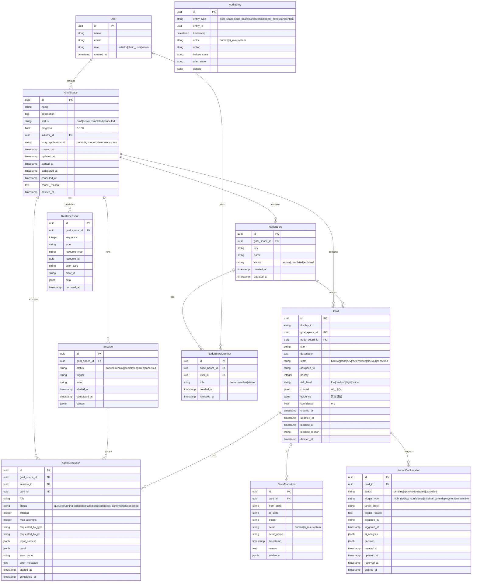

# KEPLAR 数据库设计规范

## 1. 统一建模决策

| 项目 | 决策 |
|------|------|
| 领域模型主来源 | 第一阶段以 TypeScript/Drizzle schema 为数据库和接口类型主来源，Rust 后续对齐同一契约 |
| 目标空间 | `goal_spaces` 是核心聚合根 |
| 节点看板 | `node_boards` 需要持久化，用于节点视图、成员访问和上下游流转 |
| 节点成员 | `node_board_members` 是节点访问控制来源，不使用 `node_boards.members` JSON 作为权限边界 |
| 会话 | `sessions` 表示一次目标空间运行会话，用于分组 AI 执行、SSE 恢复、审计关联和断点续传 |
| AI 执行 | `agent_executions` 表示一次 AI 角色执行；`agent_executions.id` 是 API 返回的 `task_id` |
| 卡片主键 | `cards.id` 使用 UUID |
| 卡片展示编号 | `cards.display_id` 保存 `CARD-001` 等人类可读编号 |
| 目标空间状态 | `draft` / `active` / `completed` / `cancelled`；完成和取消是不同终态 |
| 卡片状态 | `backlog` / `todo` / `dev` / `review` / `done` / `blocked` / `cancelled` |
| 优先级 | `priority` 使用整数，数值越大优先级越高 |
| 风险等级 | `risk_level` 是一等字段：`low` / `medium` / `high` / `critical` |
| 删除策略 | 业务实体默认软删除；治理记录和审计记录不级联删除 |
| 审计策略 | `audit_entries` append-only，状态变更与审计写入必须同事务 |
| 实时事件 | `realtime_events` append-only，用于 SSE replay 和 Dashboard 状态补偿 |

## 2. 实体关系图



---

## 3. 表结构定义

### 3.1 goal_spaces（目标空间表）

| 字段 | 类型 | 约束 | 说明 |
|------|------|------|------|
| id | UUID | PK, DEFAULT uuid_generate_v4() | 主键 |
| name | VARCHAR(255) | NOT NULL | 目标名称 |
| description | TEXT | | 目标描述 |
| constraints | JSONB | DEFAULT '[]' | 约束条件列表 |
| acceptance_criteria | JSONB | DEFAULT '[]' | 验收标准 |
| status | VARCHAR(20) | NOT NULL, DEFAULT 'draft' | 状态：draft/active/completed/cancelled |
| progress | FLOAT | DEFAULT 0 | 完成进度 0-100 |
| initiator_id | UUID | FK → users.id | 发起人 |
| story_application_id | TEXT | NULL | Story 草稿应用幂等键；仅在同一 initiator 内唯一；SQLite 不设长度约束，接口层限制为 4,000 字符 |
| started_at | TIMESTAMP | | 进入 Active 时间 |
| completed_at | TIMESTAMP | | 进入 Completed 时间 |
| cancelled_at | TIMESTAMP | | 进入 Cancelled 时间 |
| cancel_reason | TEXT | | 取消原因；status=cancelled 时必填 |
| deleted_at | TIMESTAMP | | 软删除时间；不物理删除治理记录 |
| created_at | TIMESTAMP | DEFAULT NOW() | 创建时间 |
| updated_at | TIMESTAMP | DEFAULT NOW() | 更新时间 |

**索引：**
```sql
CREATE INDEX idx_goal_spaces_status ON goal_spaces(status);
CREATE INDEX idx_goal_spaces_initiator ON goal_spaces(initiator_id);
CREATE UNIQUE INDEX idx_goal_spaces_initiator_story_application_id_unique ON goal_spaces(initiator_id, story_application_id);
CREATE INDEX idx_goal_spaces_created ON goal_spaces(created_at DESC);
```

---

### 3.2 node_boards（节点看板表）

| 字段 | 类型 | 约束 | 说明 |
|------|------|------|------|
| id | UUID | PK, DEFAULT uuid_generate_v4() | 主键 |
| goal_space_id | UUID | FK -> goal_spaces.id, NOT NULL | 所属目标空间 |
| key | VARCHAR(100) | NOT NULL | 节点稳定标识，如 `requirements` |
| name | VARCHAR(255) | NOT NULL | 节点显示名称 |
| description | TEXT | | 节点说明 |
| status | VARCHAR(20) | NOT NULL, DEFAULT 'active' | 状态：active/completed/archived |
| created_at | TIMESTAMP | DEFAULT NOW() | 创建时间 |
| updated_at | TIMESTAMP | DEFAULT NOW() | 更新时间 |
| deleted_at | TIMESTAMP | | 软删除时间 |

**索引：**
```sql
CREATE INDEX idx_node_boards_goal_space ON node_boards(goal_space_id);
CREATE UNIQUE INDEX idx_node_boards_key ON node_boards(goal_space_id, key) WHERE deleted_at IS NULL;
CREATE INDEX idx_node_boards_status ON node_boards(status);
```

---

### 3.3 node_board_members（节点成员表）

| 字段 | 类型 | 约束 | 说明 |
|------|------|------|------|
| id | UUID | PK, DEFAULT uuid_generate_v4() | 主键 |
| node_board_id | UUID | FK -> node_boards.id, NOT NULL | 节点看板 |
| user_id | UUID | FK -> users.id, NOT NULL | 成员用户 |
| role | VARCHAR(20) | NOT NULL, DEFAULT 'member' | owner/member/viewer |
| created_at | TIMESTAMP | DEFAULT NOW() | 加入时间 |
| removed_at | TIMESTAMP | | 移除时间；为空表示有效成员 |

**约束：**
- 有效成员唯一性由 `(node_board_id, user_id) WHERE removed_at IS NULL` 保证。
- 权限判断必须读取 `node_board_members`，不得读取 `node_boards.members`。
- 成员变更必须写入 `audit_entries`。

**索引：**
```sql
CREATE UNIQUE INDEX idx_node_board_members_active ON node_board_members(node_board_id, user_id) WHERE removed_at IS NULL;
CREATE INDEX idx_node_board_members_user ON node_board_members(user_id) WHERE removed_at IS NULL;
CREATE INDEX idx_node_board_members_board ON node_board_members(node_board_id) WHERE removed_at IS NULL;
```

---

### 3.4 sessions（运行会话表）

| 字段 | 类型 | 约束 | 说明 |
|------|------|------|------|
| id | UUID | PK, DEFAULT uuid_generate_v4() | 主键 |
| goal_space_id | UUID | FK -> goal_spaces.id, NOT NULL | 所属目标空间 |
| status | VARCHAR(20) | NOT NULL, DEFAULT 'queued' | 状态：queued/running/completed/failed/cancelled |
| trigger | VARCHAR(50) | NOT NULL | 触发来源，如 manual_start/ai_retry/system_resume |
| actor | VARCHAR(30) | NOT NULL | 执行者：human/ai_role/system |
| actor_name | VARCHAR(100) | | 用户名或 AI 角色 |
| context | JSONB | DEFAULT '{}' | 会话上下文 |
| started_at | TIMESTAMP | | 开始时间 |
| completed_at | TIMESTAMP | | 结束时间 |
| created_at | TIMESTAMP | DEFAULT NOW() | 创建时间 |
| updated_at | TIMESTAMP | DEFAULT NOW() | 更新时间 |

**索引：**
```sql
CREATE INDEX idx_sessions_goal_space ON sessions(goal_space_id);
CREATE INDEX idx_sessions_status ON sessions(status);
CREATE INDEX idx_sessions_created ON sessions(created_at DESC);
```

---

### 3.5 agent_executions（AI 执行任务表）

| 字段 | 类型 | 约束 | 说明 |
|------|------|------|------|
| id | UUID | PK, DEFAULT uuid_generate_v4() | 执行任务 ID；对外作为 `task_id` |
| goal_space_id | UUID | FK -> goal_spaces.id, NOT NULL | 所属目标空间，用于权限和查询 |
| session_id | UUID | FK -> sessions.id | 所属运行会话；手动单卡执行可为空 |
| card_id | UUID | FK -> cards.id, NOT NULL | 执行目标卡片 |
| role | VARCHAR(50) | NOT NULL | AI 角色名 |
| status | VARCHAR(30) | NOT NULL, DEFAULT 'queued' | queued/running/completed/failed/blocked/needs_confirmation/cancelled |
| attempt | INTEGER | NOT NULL, DEFAULT 1 | 当前尝试次数 |
| max_attempts | INTEGER | NOT NULL, DEFAULT 2 | 最大尝试次数 |
| requested_by_type | VARCHAR(30) | NOT NULL | human/ai_role/system |
| requested_by_id | VARCHAR(100) | | 触发者 ID |
| requested_by_name | VARCHAR(100) | | 触发者名称 |
| input_context | JSONB | DEFAULT '{}' | 传入 AI executor 的上下文 |
| result | JSONB | | 通过校验后的 AI 输出 |
| error_code | VARCHAR(50) | | 失败错误码 |
| error_message | TEXT | | 失败说明 |
| started_at | TIMESTAMP | | 开始时间 |
| completed_at | TIMESTAMP | | 结束时间 |
| created_at | TIMESTAMP | DEFAULT NOW() | 创建时间 |
| updated_at | TIMESTAMP | DEFAULT NOW() | 更新时间 |

**约束：**
- `agent_executions.id` 是 `POST /api/v1/cards/:id/execute` 返回的 `task_id`。
- 重试更新同一条 `agent_executions`，并递增 `attempt`；不得为一次重试创建新的 `task_id`。
- `completed/failed/blocked/needs_confirmation/cancelled` 是终态。
- AI 输出写入 `result` 前必须通过 `docs/specs/ai_agent_contracts.md` 校验。

**索引：**
```sql
CREATE INDEX idx_agent_executions_goal_space ON agent_executions(goal_space_id);
CREATE INDEX idx_agent_executions_session ON agent_executions(session_id);
CREATE INDEX idx_agent_executions_card ON agent_executions(card_id);
CREATE INDEX idx_agent_executions_status ON agent_executions(status);
CREATE INDEX idx_agent_executions_role ON agent_executions(role);
CREATE INDEX idx_agent_executions_created ON agent_executions(created_at DESC);
```

---

### 3.6 cards（卡片表）

| 字段 | 类型 | 约束 | 说明 |
|------|------|------|------|
| id | UUID | PK, DEFAULT uuid_generate_v4() | 主键 |
| display_id | VARCHAR(50) | NOT NULL | 人类可读编号，如 CARD-001 |
| goal_space_id | UUID | FK → goal_spaces.id, NOT NULL | 所属目标空间 |
| node_board_id | UUID | FK → node_boards.id | 所属节点看板 |
| title | VARCHAR(500) | NOT NULL | 卡片标题 |
| description | TEXT | | 详细描述 |
| state | VARCHAR(20) | NOT NULL, DEFAULT 'backlog' | backlog/todo/dev/review/done/blocked/cancelled |
| assigned_to | VARCHAR(255) | | 分配对象 |
| priority | INTEGER | DEFAULT 0 | 优先级，数值越大越优先 |
| risk_level | VARCHAR(20) | NOT NULL, DEFAULT 'medium' | 风险等级：low/medium/high/critical |
| context | JSONB | DEFAULT '{}' | AI 上下文信息 |
| evidence | JSONB | DEFAULT '[]' | 实现证据列表 |
| confidence | FLOAT | | AI 置信度 0-1 |
| blocked_reason | TEXT | | 阻塞原因 |
| blocked_at | TIMESTAMP | | 进入 Blocked 时间 |
| dependencies | JSONB | DEFAULT '[]' | 依赖卡片 ID 列表 |
| tags | JSONB | DEFAULT '[]' | 标签；不得替代 `risk_level` |
| deleted_at | TIMESTAMP | | 软删除时间 |
| created_at | TIMESTAMP | DEFAULT NOW() | 创建时间 |
| updated_at | TIMESTAMP | DEFAULT NOW() | 更新时间 |

**索引：**
```sql
CREATE INDEX idx_cards_goal_space ON cards(goal_space_id);
CREATE UNIQUE INDEX idx_cards_display_id ON cards(goal_space_id, display_id) WHERE deleted_at IS NULL;
CREATE INDEX idx_cards_node_board ON cards(node_board_id);
CREATE INDEX idx_cards_state ON cards(state);
CREATE INDEX idx_cards_assigned ON cards(assigned_to);
CREATE INDEX idx_cards_priority ON cards(priority DESC);
CREATE INDEX idx_cards_risk_level ON cards(risk_level);
CREATE INDEX idx_cards_created ON cards(created_at DESC);
CREATE INDEX idx_cards_tags ON cards USING GIN(tags);
```

---

### 3.7 state_transitions（状态流转记录表）

| 字段 | 类型 | 约束 | 说明 |
|------|------|------|------|
| id | UUID | PK, DEFAULT uuid_generate_v4() | 主键 |
| card_id | UUID | FK → cards.id, NOT NULL | 卡片 ID |
| session_id | UUID | FK → sessions.id | 关联会话 |
| from_state | VARCHAR(20) | | 原始状态 |
| to_state | VARCHAR(20) | NOT NULL | 目标状态 |
| trigger | VARCHAR(50) | | 触发原因 |
| actor | VARCHAR(30) | NOT NULL | 执行者：human/ai_role/system |
| actor_name | VARCHAR(100) | | AI 角色名或用户名 |
| reason | TEXT | | 变更原因 |
| evidence | JSONB | | 证据数据 |
| timestamp | TIMESTAMP | DEFAULT NOW() | 发生时间 |

**索引：**
```sql
CREATE INDEX idx_transitions_card ON state_transitions(card_id);
CREATE INDEX idx_transitions_session ON state_transitions(session_id);
CREATE INDEX idx_transitions_timestamp ON state_transitions(timestamp DESC);
CREATE INDEX idx_transitions_actor ON state_transitions(actor);
```

---

### 3.8 human_confirmations（人工确认表）

| 字段 | 类型 | 约束 | 说明 |
|------|------|------|------|
| id | UUID | PK, DEFAULT uuid_generate_v4() | 主键 |
| card_id | UUID | FK → cards.id, NOT NULL | 关联卡片 |
| status | VARCHAR(20) | NOT NULL, DEFAULT 'pending' | 确认状态 |
| trigger_type | VARCHAR(30) | NOT NULL | high_risk/low_confidence/external_write/deployment/irreversible |
| target_state | VARCHAR(20) | NOT NULL | 确认通过后要进入的卡片状态 |
| trigger_reason | TEXT | NOT NULL | 触发原因 |
| triggered_by | VARCHAR(100) | NOT NULL | 触发者（AI 角色名） |
| triggered_at | TIMESTAMP | DEFAULT NOW() | 触发时间 |
| ai_summary | TEXT | | AI 分析摘要 |
| risk_factors | JSONB | | 风险因素列表 |
| recommendations | JSONB | | 建议列表 |
| ai_confidence | FLOAT | | AI 原始置信度 |
| decision_outcome | VARCHAR(20) | | 决策结果：approved/rejected |
| decided_by | UUID | FK → users.id | 决策人 |
| decided_at | TIMESTAMP | | 决策时间 |
| decision_comment | TEXT | | 决策备注 |
| decision_reason | TEXT | | 拒绝原因（必填） |
| resolved_at | TIMESTAMP | | 解决时间 |
| expires_at | TIMESTAMP | NOT NULL | 过期时间（24h后） |
| created_at | TIMESTAMP | DEFAULT NOW() | 创建时间 |
| updated_at | TIMESTAMP | DEFAULT NOW() | 更新时间 |

**索引：**
```sql
CREATE UNIQUE INDEX idx_confirm_card ON human_confirmations(card_id) WHERE status = 'pending';
CREATE INDEX idx_confirm_status ON human_confirmations(status);
CREATE INDEX idx_confirm_expires ON human_confirmations(expires_at);
CREATE INDEX idx_confirm_decided_by ON human_confirmations(decided_by);
```

---

### 3.9 audit_entries（审计轨迹表）

| 字段 | 类型 | 约束 | 说明 |
|------|------|------|------|
| id | UUID | PK, DEFAULT uuid_generate_v4() | 主键 |
| entity_type | VARCHAR(30) | NOT NULL | 实体类型：goal_space/node_board/node_board_member/card/session/agent_execution/confirm |
| entity_id | UUID | NOT NULL | 实体 ID |
| timestamp | TIMESTAMP | DEFAULT NOW() | 时间 |
| actor | VARCHAR(30) | NOT NULL | 操作者 |
| action | VARCHAR(50) | NOT NULL | 操作类型 |
| before_state | JSONB | | 变更前状态 |
| after_state | JSONB | | 变更后状态 |
| details | JSONB | | 详细信息 |

**约束：**
- 审计记录 append-only，不提供业务更新或删除路径。
- 所有状态变更必须和审计写入在同一事务中完成。
- 审计写入失败时，主业务操作必须失败。

**索引：**
```sql
CREATE INDEX idx_audit_entity ON audit_entries(entity_type, entity_id);
CREATE INDEX idx_audit_timestamp ON audit_entries(timestamp DESC);
CREATE INDEX idx_audit_actor ON audit_entries(actor);
```

---

### 3.10 realtime_events（实时事件表）

| 字段 | 类型 | 约束 | 说明 |
|------|------|------|------|
| id | UUID | PK, DEFAULT uuid_generate_v4() | 事件 ID，同时作为 SSE `id` 和 replay cursor |
| goal_space_id | UUID | FK -> goal_spaces.id, NOT NULL | 所属目标空间 |
| sequence | BIGINT | NOT NULL | 目标空间内单调递增序号 |
| type | VARCHAR(50) | NOT NULL | 事件类型，详见 `docs/specs/realtime_events.md` |
| resource_type | VARCHAR(30) | NOT NULL | goal_space/node_board/node_board_member/card/session/agent_execution/confirmation |
| resource_id | UUID | NOT NULL | 资源 ID |
| actor_type | VARCHAR(30) | NOT NULL | human/ai_role/system |
| actor_id | VARCHAR(100) | | 用户 ID 或 AI 角色名 |
| data | JSONB | DEFAULT '{}' | 事件载荷 |
| occurred_at | TIMESTAMP | DEFAULT NOW() | 事件发生时间 |

**约束：**
- 实时事件 append-only，不提供业务更新或删除路径。
- 持久化状态变更必须在同一事务内写入业务行、`audit_entries` 和 `realtime_events`。
- `sequence` 必须在同一 `goal_space_id` 内单调递增，用于 replay 排序。

**索引：**
```sql
CREATE UNIQUE INDEX idx_realtime_events_sequence ON realtime_events(goal_space_id, sequence);
CREATE INDEX idx_realtime_events_goal_space ON realtime_events(goal_space_id, occurred_at DESC);
CREATE INDEX idx_realtime_events_resource ON realtime_events(resource_type, resource_id);
```

---

### 3.11 users（用户表）

| 字段 | 类型 | 约束 | 说明 |
|------|------|------|------|
| id | UUID | PK, DEFAULT uuid_generate_v4() | 主键 |
| name | VARCHAR(100) | NOT NULL | 用户名 |
| email | VARCHAR(255) | UNIQUE, NOT NULL | 邮箱 |
| role | VARCHAR(20) | NOT NULL, DEFAULT 'chain_user' | 角色 |
| preferences | JSONB | DEFAULT '{}' | 偏好设置 |
| created_at | TIMESTAMP | DEFAULT NOW() | 创建时间 |
| last_login_at | TIMESTAMP | | 最后登录 |

**索引：**
```sql
CREATE UNIQUE INDEX idx_users_email ON users(email);
CREATE INDEX idx_users_role ON users(role);
```

---

## 4. 关系约束

### 4.1 外键约束

```sql
-- GoalSpace → User
ALTER TABLE goal_spaces ADD CONSTRAINT fk_goal_spaces_initiator
  FOREIGN KEY (initiator_id) REFERENCES users(id);

-- NodeBoard → GoalSpace
ALTER TABLE node_boards ADD CONSTRAINT fk_node_boards_goal_space
  FOREIGN KEY (goal_space_id) REFERENCES goal_spaces(id);

-- NodeBoardMember → NodeBoard / User
ALTER TABLE node_board_members ADD CONSTRAINT fk_node_board_members_board
  FOREIGN KEY (node_board_id) REFERENCES node_boards(id);
ALTER TABLE node_board_members ADD CONSTRAINT fk_node_board_members_user
  FOREIGN KEY (user_id) REFERENCES users(id);

-- Session → GoalSpace
ALTER TABLE sessions ADD CONSTRAINT fk_sessions_goal_space
  FOREIGN KEY (goal_space_id) REFERENCES goal_spaces(id);

-- AgentExecution → GoalSpace / Session / Card
ALTER TABLE agent_executions ADD CONSTRAINT fk_agent_executions_goal_space
  FOREIGN KEY (goal_space_id) REFERENCES goal_spaces(id);
ALTER TABLE agent_executions ADD CONSTRAINT fk_agent_executions_session
  FOREIGN KEY (session_id) REFERENCES sessions(id);
ALTER TABLE agent_executions ADD CONSTRAINT fk_agent_executions_card
  FOREIGN KEY (card_id) REFERENCES cards(id);

-- Card → GoalSpace
ALTER TABLE cards ADD CONSTRAINT fk_cards_goal_space
  FOREIGN KEY (goal_space_id) REFERENCES goal_spaces(id);

-- Card → NodeBoard
ALTER TABLE cards ADD CONSTRAINT fk_cards_node_board
  FOREIGN KEY (node_board_id) REFERENCES node_boards(id);

-- StateTransition → Card
ALTER TABLE state_transitions ADD CONSTRAINT fk_transitions_card
  FOREIGN KEY (card_id) REFERENCES cards(id);

-- StateTransition → Session
ALTER TABLE state_transitions ADD CONSTRAINT fk_transitions_session
  FOREIGN KEY (session_id) REFERENCES sessions(id);

-- HumanConfirmation → Card
ALTER TABLE human_confirmations ADD CONSTRAINT fk_confirm_card
  FOREIGN KEY (card_id) REFERENCES cards(id);

-- HumanConfirmation → User (decided_by)
ALTER TABLE human_confirmations ADD CONSTRAINT fk_confirm_decided_by
  FOREIGN KEY (decided_by) REFERENCES users(id);
```

### 4.2 删除策略

- 第一阶段不允许物理删除业务实体，统一使用 `deleted_at` 软删除。
- `state_transitions`、`human_confirmations`、`sessions`、`agent_executions`、`audit_entries` 不随 Card 或 GoalSpace 删除而级联删除。
- 如果后续需要清理数据，必须通过归档任务执行，并保留审计摘要。

---

## 5. 高级特性

### 5.1 JSONB 字段查询示例

```sql
-- 查询高风险卡片
SELECT * FROM cards WHERE risk_level IN ('high', 'critical');

-- 查询置信度低于 0.7 的卡片
SELECT * FROM cards WHERE confidence < 0.7;

-- 查询指定 AI 角色触发的确认
SELECT * FROM human_confirmations WHERE triggered_by = 'Review Guard';
```

### 5.2 状态聚合查询

```sql
-- 获取目标空间的卡片状态聚合
SELECT
  gs.id,
  gs.name,
  COUNT(CASE WHEN c.state = 'backlog' THEN 1 END) as backlog_count,
  COUNT(CASE WHEN c.state = 'todo' THEN 1 END) as todo_count,
  COUNT(CASE WHEN c.state = 'dev' THEN 1 END) as dev_count,
  COUNT(CASE WHEN c.state = 'review' THEN 1 END) as review_count,
  COUNT(CASE WHEN c.state = 'done' THEN 1 END) as done_count,
  COUNT(CASE WHEN c.state = 'blocked' THEN 1 END) as blocked_count,
  COUNT(CASE WHEN c.state = 'cancelled' THEN 1 END) as cancelled_count
FROM goal_spaces gs
LEFT JOIN cards c ON c.goal_space_id = gs.id
WHERE gs.deleted_at IS NULL AND c.deleted_at IS NULL
GROUP BY gs.id;
```

---

## 6. SQLite 兼容注意事项

Demo 模式使用 SQLite，部分特性受限：

| 特性 | PostgreSQL | SQLite |
|------|------------|--------|
| UUID | uuid_generate_v4() | text storage |
| JSONB | 原生支持 | text 存储，JSON() 函数查询 |
| GIN 索引 | 支持 | 不支持，改用普通索引 |
| 外键约束 | 完全支持 | 需 PRAGMA foreign_keys = ON |
| 软删除 | `deleted_at` 字段 | `deleted_at` 字段 |
| 自增序号 | identity / sequence | INTEGER 或事务内 max(sequence)+1 |

**SQLite 建表示例：**
```sql
CREATE TABLE cards (
  id TEXT PRIMARY KEY DEFAULT (lower(hex(randomblob(16)))),
  display_id TEXT NOT NULL,
  goal_space_id TEXT NOT NULL,
  node_board_id TEXT,
  title TEXT NOT NULL,
  state TEXT NOT NULL DEFAULT 'backlog',
  priority INTEGER DEFAULT 0,
  risk_level TEXT NOT NULL DEFAULT 'medium',
  context TEXT DEFAULT '{}',
  evidence TEXT DEFAULT '[]',
  confidence REAL,
  deleted_at TEXT,
  created_at TEXT DEFAULT (datetime('now')),
  updated_at TEXT DEFAULT (datetime('now')),
  FOREIGN KEY (goal_space_id) REFERENCES goal_spaces(id)
);
```

---

## 7. 迁移策略

### 7.1 初始迁移（Drizzle风格）

```typescript
// migrations/001_initial_schema.ts
export async function up(db: Database) {
  await db.execute(sql`
    CREATE TABLE IF NOT EXISTS users (
      id TEXT PRIMARY KEY DEFAULT (lower(hex(randomblob(16)))),
      name TEXT NOT NULL,
      email TEXT UNIQUE NOT NULL,
      role TEXT NOT NULL DEFAULT 'chain_user',
      preferences TEXT DEFAULT '{}',
      created_at TEXT DEFAULT (datetime('now')),
      last_login_at TEXT
    );

    CREATE TABLE IF NOT EXISTS goal_spaces (
      id TEXT PRIMARY KEY DEFAULT (lower(hex(randomblob(16)))),
      name TEXT NOT NULL,
      description TEXT,
      constraints TEXT DEFAULT '[]',
      acceptance_criteria TEXT DEFAULT '[]',
      status TEXT NOT NULL DEFAULT 'draft',
      progress REAL DEFAULT 0,
      initiator_id TEXT REFERENCES users(id),
      started_at TEXT,
      completed_at TEXT,
      cancelled_at TEXT,
      cancel_reason TEXT,
      deleted_at TEXT,
      created_at TEXT DEFAULT (datetime('now')),
      updated_at TEXT DEFAULT (datetime('now'))
    );

    CREATE TABLE IF NOT EXISTS node_boards (
      id TEXT PRIMARY KEY DEFAULT (lower(hex(randomblob(16)))),
      goal_space_id TEXT NOT NULL REFERENCES goal_spaces(id),
      key TEXT NOT NULL,
      name TEXT NOT NULL,
      description TEXT,
      status TEXT NOT NULL DEFAULT 'active',
      deleted_at TEXT,
      created_at TEXT DEFAULT (datetime('now')),
      updated_at TEXT DEFAULT (datetime('now'))
    );

    CREATE TABLE IF NOT EXISTS node_board_members (
      id TEXT PRIMARY KEY DEFAULT (lower(hex(randomblob(16)))),
      node_board_id TEXT NOT NULL REFERENCES node_boards(id),
      user_id TEXT NOT NULL REFERENCES users(id),
      role TEXT NOT NULL DEFAULT 'member',
      created_at TEXT DEFAULT (datetime('now')),
      removed_at TEXT
    );

    CREATE TABLE IF NOT EXISTS sessions (
      id TEXT PRIMARY KEY DEFAULT (lower(hex(randomblob(16)))),
      goal_space_id TEXT NOT NULL REFERENCES goal_spaces(id),
      status TEXT NOT NULL DEFAULT 'queued',
      trigger TEXT NOT NULL,
      actor TEXT NOT NULL,
      actor_name TEXT,
      context TEXT DEFAULT '{}',
      started_at TEXT,
      completed_at TEXT,
      created_at TEXT DEFAULT (datetime('now')),
      updated_at TEXT DEFAULT (datetime('now'))
    );

    CREATE TABLE IF NOT EXISTS cards (
      id TEXT PRIMARY KEY DEFAULT (lower(hex(randomblob(16)))),
      display_id TEXT NOT NULL,
      goal_space_id TEXT NOT NULL REFERENCES goal_spaces(id),
      node_board_id TEXT REFERENCES node_boards(id),
      title TEXT NOT NULL,
      description TEXT,
      state TEXT NOT NULL DEFAULT 'backlog',
      assigned_to TEXT,
      priority INTEGER DEFAULT 0,
      risk_level TEXT NOT NULL DEFAULT 'medium',
      context TEXT DEFAULT '{}',
      evidence TEXT DEFAULT '[]',
      confidence REAL,
      blocked_reason TEXT,
      blocked_at TEXT,
      dependencies TEXT DEFAULT '[]',
      tags TEXT DEFAULT '[]',
      deleted_at TEXT,
      created_at TEXT DEFAULT (datetime('now')),
      updated_at TEXT DEFAULT (datetime('now'))
    );

    CREATE TABLE IF NOT EXISTS agent_executions (
      id TEXT PRIMARY KEY DEFAULT (lower(hex(randomblob(16)))),
      goal_space_id TEXT NOT NULL REFERENCES goal_spaces(id),
      session_id TEXT REFERENCES sessions(id),
      card_id TEXT NOT NULL REFERENCES cards(id),
      role TEXT NOT NULL,
      status TEXT NOT NULL DEFAULT 'queued',
      attempt INTEGER NOT NULL DEFAULT 1,
      max_attempts INTEGER NOT NULL DEFAULT 2,
      requested_by_type TEXT NOT NULL,
      requested_by_id TEXT,
      requested_by_name TEXT,
      input_context TEXT DEFAULT '{}',
      result TEXT,
      error_code TEXT,
      error_message TEXT,
      started_at TEXT,
      completed_at TEXT,
      created_at TEXT DEFAULT (datetime('now')),
      updated_at TEXT DEFAULT (datetime('now'))
    );

    CREATE TABLE IF NOT EXISTS state_transitions (
      id TEXT PRIMARY KEY DEFAULT (lower(hex(randomblob(16)))),
      card_id TEXT NOT NULL REFERENCES cards(id),
      session_id TEXT REFERENCES sessions(id),
      from_state TEXT,
      to_state TEXT NOT NULL,
      trigger TEXT,
      actor TEXT NOT NULL,
      actor_name TEXT,
      reason TEXT,
      evidence TEXT DEFAULT '[]',
      timestamp TEXT DEFAULT (datetime('now'))
    );

    CREATE TABLE IF NOT EXISTS human_confirmations (
      id TEXT PRIMARY KEY DEFAULT (lower(hex(randomblob(16)))),
      card_id TEXT NOT NULL REFERENCES cards(id),
      status TEXT NOT NULL DEFAULT 'pending',
      trigger_type TEXT NOT NULL,
      target_state TEXT NOT NULL,
      trigger_reason TEXT NOT NULL,
      triggered_by TEXT NOT NULL,
      triggered_at TEXT DEFAULT (datetime('now')),
      ai_summary TEXT,
      risk_factors TEXT DEFAULT '[]',
      recommendations TEXT DEFAULT '[]',
      ai_confidence REAL,
      decision_outcome TEXT,
      decided_by TEXT REFERENCES users(id),
      decided_at TEXT,
      decision_comment TEXT,
      decision_reason TEXT,
      resolved_at TEXT,
      expires_at TEXT NOT NULL,
      created_at TEXT DEFAULT (datetime('now')),
      updated_at TEXT DEFAULT (datetime('now'))
    );

    CREATE TABLE IF NOT EXISTS audit_entries (
      id TEXT PRIMARY KEY DEFAULT (lower(hex(randomblob(16)))),
      entity_type TEXT NOT NULL,
      entity_id TEXT NOT NULL,
      timestamp TEXT DEFAULT (datetime('now')),
      actor TEXT NOT NULL,
      action TEXT NOT NULL,
      before_state TEXT,
      after_state TEXT,
      details TEXT DEFAULT '{}'
    );

    CREATE TABLE IF NOT EXISTS realtime_events (
      id TEXT PRIMARY KEY DEFAULT (lower(hex(randomblob(16)))),
      goal_space_id TEXT NOT NULL REFERENCES goal_spaces(id),
      sequence INTEGER NOT NULL,
      type TEXT NOT NULL,
      resource_type TEXT NOT NULL,
      resource_id TEXT NOT NULL,
      actor_type TEXT NOT NULL,
      actor_id TEXT,
      data TEXT DEFAULT '{}',
      occurred_at TEXT DEFAULT (datetime('now')),
      UNIQUE(goal_space_id, sequence)
    );

    CREATE UNIQUE INDEX IF NOT EXISTS idx_node_board_members_active
      ON node_board_members(node_board_id, user_id)
      WHERE removed_at IS NULL;
    CREATE INDEX IF NOT EXISTS idx_goal_spaces_status ON goal_spaces(status);
    CREATE INDEX IF NOT EXISTS idx_goal_spaces_initiator ON goal_spaces(initiator_id);
    CREATE INDEX IF NOT EXISTS idx_goal_spaces_created ON goal_spaces(created_at DESC);
    CREATE INDEX IF NOT EXISTS idx_node_boards_goal_space ON node_boards(goal_space_id);
    CREATE UNIQUE INDEX IF NOT EXISTS idx_node_boards_key ON node_boards(goal_space_id, key)
      WHERE deleted_at IS NULL;
    CREATE INDEX IF NOT EXISTS idx_node_boards_status ON node_boards(status);
    CREATE INDEX IF NOT EXISTS idx_node_board_members_user ON node_board_members(user_id)
      WHERE removed_at IS NULL;
    CREATE INDEX IF NOT EXISTS idx_node_board_members_board ON node_board_members(node_board_id)
      WHERE removed_at IS NULL;
    CREATE INDEX IF NOT EXISTS idx_sessions_goal_space ON sessions(goal_space_id);
    CREATE INDEX IF NOT EXISTS idx_sessions_status ON sessions(status);
    CREATE INDEX IF NOT EXISTS idx_sessions_created ON sessions(created_at DESC);
    CREATE INDEX IF NOT EXISTS idx_cards_goal_space ON cards(goal_space_id);
    CREATE UNIQUE INDEX IF NOT EXISTS idx_cards_display_id ON cards(goal_space_id, display_id)
      WHERE deleted_at IS NULL;
    CREATE INDEX IF NOT EXISTS idx_cards_node_board ON cards(node_board_id);
    CREATE INDEX IF NOT EXISTS idx_cards_state ON cards(state);
    CREATE INDEX IF NOT EXISTS idx_cards_assigned ON cards(assigned_to);
    CREATE INDEX IF NOT EXISTS idx_cards_priority ON cards(priority DESC);
    CREATE INDEX IF NOT EXISTS idx_cards_risk_level ON cards(risk_level);
    CREATE INDEX IF NOT EXISTS idx_cards_created ON cards(created_at DESC);
    CREATE INDEX IF NOT EXISTS idx_agent_executions_goal_space ON agent_executions(goal_space_id);
    CREATE INDEX IF NOT EXISTS idx_agent_executions_session ON agent_executions(session_id);
    CREATE INDEX IF NOT EXISTS idx_agent_executions_card ON agent_executions(card_id);
    CREATE INDEX IF NOT EXISTS idx_agent_executions_status ON agent_executions(status);
    CREATE INDEX IF NOT EXISTS idx_agent_executions_role ON agent_executions(role);
    CREATE INDEX IF NOT EXISTS idx_agent_executions_created ON agent_executions(created_at DESC);
    CREATE INDEX IF NOT EXISTS idx_transitions_card ON state_transitions(card_id);
    CREATE INDEX IF NOT EXISTS idx_transitions_session ON state_transitions(session_id);
    CREATE INDEX IF NOT EXISTS idx_transitions_timestamp ON state_transitions(timestamp DESC);
    CREATE INDEX IF NOT EXISTS idx_transitions_actor ON state_transitions(actor);
    CREATE UNIQUE INDEX IF NOT EXISTS idx_confirm_card ON human_confirmations(card_id)
      WHERE status = 'pending';
    CREATE INDEX IF NOT EXISTS idx_confirm_status ON human_confirmations(status);
    CREATE INDEX IF NOT EXISTS idx_confirm_expires ON human_confirmations(expires_at);
    CREATE INDEX IF NOT EXISTS idx_confirm_decided_by ON human_confirmations(decided_by);
    CREATE INDEX IF NOT EXISTS idx_audit_entity ON audit_entries(entity_type, entity_id);
    CREATE INDEX IF NOT EXISTS idx_audit_timestamp ON audit_entries(timestamp DESC);
    CREATE INDEX IF NOT EXISTS idx_audit_actor ON audit_entries(actor);
    CREATE UNIQUE INDEX IF NOT EXISTS idx_realtime_events_sequence ON realtime_events(goal_space_id, sequence);
    CREATE INDEX IF NOT EXISTS idx_realtime_events_goal_space ON realtime_events(goal_space_id, occurred_at DESC);
    CREATE INDEX IF NOT EXISTS idx_realtime_events_resource ON realtime_events(resource_type, resource_id);
    CREATE INDEX IF NOT EXISTS idx_users_role ON users(role);
  `);
}
```

---

## 8. 数据字典摘要

| 表名 | 说明 | 行数估算 |
|------|------|---------|
| users | 用户表 | 10-100 |
| goal_spaces | 目标空间表 | 5-50 |
| node_boards | 节点看板表 | 10-200 |
| node_board_members | 节点成员表 | 20-500 |
| sessions | 运行会话表 | 10-500 |
| agent_executions | AI 执行任务表 | 50-2000 |
| cards | 卡片表 | 50-500 |
| state_transitions | 状态流转记录 | 200-2000 |
| human_confirmations | 人工确认记录 | 0-50 |
| audit_entries | 审计轨迹 | 500-5000 |
| realtime_events | 实时事件日志 | 500-5000 |
